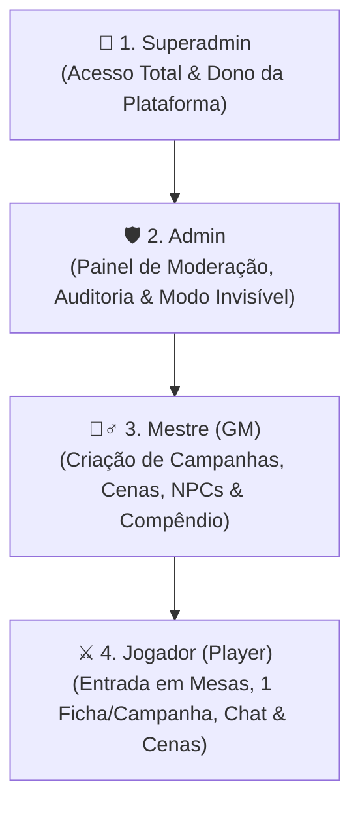

# ArcanaVTT — Módulo 01: Visão Geral & Hierarquia de Cargos (RBAC)

---

## 📖 1. Visão Geral & Propósito do Projeto

O **ArcanaVTT** é uma plataforma inovadora de mesa virtual de RPG (*Virtual Tabletop - VTT*) desenvolvida nativamente em **Flutter (com foco primordial em Android)**, apoiada por um backend serverless leve e banco de dados externo em nuvem (**Cloudflare Workers + Cloudflare D1 / WebSockets**).

Evolução direta do ecossistema concebido no *0PesadeloWebVTT / RetroForge VTT*, o ArcanaVTT transporta a flexibilidade de um VTT completo e a construção visual (*No-Code*) para a palma da mão de mestres e jogadores, proporcionando sessões ágeis, imersivas e sem atrito.

### 🌟 Pilares Fundamentais

1. **Construção Visual No-Code:** O mestre cria mundos, mapas, quebra-cabeças, árvores de diálogo e regras visuais sem precisar escrever uma única linha de código.
2. **Execução Híbrida & Mitigação Inteligente (*Client-Side First*):** O aplicativo móvel Flutter renderiza e calcula todo o estado visual, interfaces, efeitos sonoros e IA básica de NPCs localmente, enquanto o servidor mínimo na borda (Cloudflare) atua como árbitro autoritativo apenas para validar turnos, ações críticas e sincronizar o estado entre jogadores conectados.
3. **Custo Operacional Zero:** Arquitetura 100% projetada para operar dentro dos planos gratuitos (*Free Tier*) de alta performance da Cloudflare (Workers, D1, KV e WebSockets).
4. **Experiência Mobile-First:** Ergonomia otimizada para toque na tela do celular, interface com suporte a gestos a 60 FPS, consumo mínimo de bateria e dados móveis.

---

## 👥 2. Hierarquia de Cargos, Níveis de Administração & Permissões

O ArcanaVTT implementa um modelo rigoroso de controle de acesso baseado em papéis (*RBAC - Role-Based Access Control*), garantindo governança, moderação e segurança para todos os usuários da plataforma.

---

### ⚔️ 2.1. Cargo: Jogador (Player)

*Todos os novos usuários cadastrados no sistema iniciam automaticamente neste cargo (exceto o Superadmin).*

- **Ingresso em Mesas:** Pode pesquisar campanhas públicas por filtros ou solicitar entrada em campanhas através do código alfanumérico / link de convite.
- **Perfil Pessoal:** Pode editar e personalizar livremente seu perfil de usuário (nome de exibição, avatar, tema visual, preferências de áudio e acessibilidade).
- **Vínculo de Personagem:** Pode criar e vincular **1 personagem-jogador (ficha)** por campanha da qual participa.
- **Interação em Cenas:** Pode ingressar na cena ativa da mesa e interagir com os elementos e modelos de cena de acordo com as regras estabelecidas pelo Mestre (mover seu próprio token no Grid, resolver puzzles de Senha, minerar no Mahjong, responder diálogos, lutar no combate por turnos).
- **Comunicação:** Pode participar dos chats das campanhas em que estiver inserido (mensagens públicas no canal Geral, sussurros autorizados e visualização do log de combate).
- **Rolagens & Ficha:** Pode realizar testes de perícia, ataques, gerenciar seus pontos vitais e interagir com sua própria ficha de personagem.
- **Autonomia de Participação:** Pode sair de campanhas a qualquer momento por vontade própria.
- **Consulta de Conteúdo:** Pode visualizar e pesquisar sistemas de RPG, tabelas públicas e campanhas abertas com uso de filtros.
- *(Funções adicionais menores e complementares serão incorporadas nas fases subsequentes).*

---

### 🧙‍♂️ 2.2. Cargo: Mestre (Game Master - GM)

*Cargo atribuído manualmente por um Superadmin ou Admin, ou adquirido de forma automatizada através de planos/pagamento.*

- **Poderes de Jogador:** Possui todas as funcionalidades e acessos do cargo de Jogador.
- **Criação de Campanhas:** Pode criar, configurar e gerenciar suas próprias campanhas (definir regras, privacidade, limites e imagens de capa).
- **Oficina de Cenas:** Pode criar, editar, duplicar, ordenar e transicionar entre qualquer um dos 6 modelos de cena (Grid Tático, Mahjong, Senhas, Diálogos, JRPG e Terminal).
- **Customização de Compêndio:** Pode estender e editar o compêndio do sistema de RPG escolhido na campanha, criando conteúdos *Homebrew*.
- **Criação de Elementos com Limites Rígidos:** Pode criar NPCs, Ameaças, Monstros, Itens, Armas, Rituais e Pistas para suas campanhas, respeitando limites rígidos de armazenamento por categoria (para manter a leveza do banco e estabilidade da sessão).
- **Controle de Mesa:** Controla a iluminação, Neblina de Guerra (*Fog of War*), trilhas sonoras/efeitos de áudio, aprovação de descansos, iniciativa e distribuição de XP.
- **🛡️ Regra de Contexto de Campanha (Rebaixamento Local):** Caso um usuário com cargo de Mestre entre em uma campanha criada por **outro Mestre**, ele é automaticamente tratado como **Jogador** dentro daquele contexto, sem acesso aos segredos ou painéis de mestre daquela mesa específica.

---

### 🛡️ 2.3. Cargo: Administrador (Admin)

*Cargo de alta confiança, outorgado **EXCLUSIVAMENTE pelo Superadmin**.*

- **Herança Total de Funções:** Possui todas as capacidades e ferramentas dos Jogadores e dos Mestres.
- **Acesso ao Painel Administrativo:** Painel restrito e seguro para governança global da plataforma:
  - **Visão Global:** Consulta e auditoria de todas as campanhas ativas, sistemas cadastrados, perfis de usuários, fichas criadas e compêndios homebrew.
  - **Segurança & Alertas:** Acompanhamento de relatórios de segurança, detecção de tráfego suspeito, logs de erro e lista de usuários bloqueados/banidos.
  - **Modo Observador Invisível (*Ghost Spectator*):** Pode entrar em qualquer campanha ao vivo em modo 100% invisível para os participantes, permitindo fiscalizar a sessão em tempo real sem permissão de enviar mensagens no chat ou interagir com o mapa, garantindo zero interferência no jogo.
  - **Moderação de Conteúdo:** Pode alterar configurações de visibilidade de campanhas e sistemas, despublicar conteúdos impróprios ou excluir materiais que violem as diretrizes.
  - **Punição & Banimento:** Pode aplicar suspensões temporárias, bloqueios de conta ou banimento permanente de usuários do sistema como um todo.

---

### 👑 2.4. Cargo: Superadmin (Dono da Plataforma)

*Papel único, exclusivo e absoluto, reservado ao criador/proprietário do sistema.*

- **Autoridade Suprema:** Acesso irrestrito e incondicional a 100% das rotas, bancos de dados, painéis e configurações do sistema.
- **Auditoria Total de Comunicações:** Possui permissão de visualizar **todas as conversas e chats privados (DMs 1-a-1)** do sistema para fins de auditoria, segurança e resolução de denúncias graves.
- **Gestão de Administradores:** É o único papel capaz de conceder ou revogar o cargo de **Admin** para outros usuários.
- **Controle Estrutural:** Acesso direto às configurações de infraestrutura, migrações de banco D1, faturamento/planos e políticas globais da plataforma.
