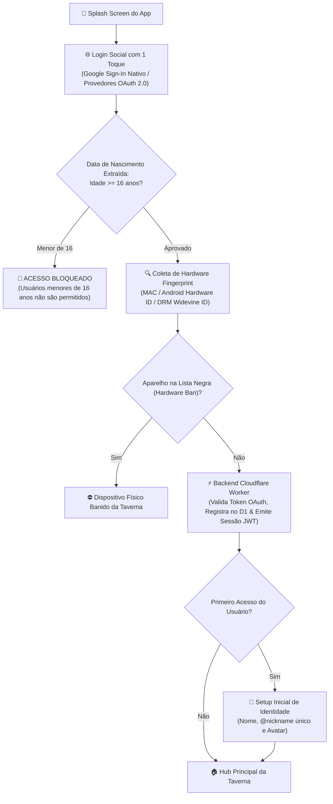

# ArcanaVTT — Módulo 02: Autenticação, Segurança LGPD, Fingerprint & Lockout

---

## 🔐 3. Autenticação 100% OAuth 2.0 & Conformidade LGPD

Para garantir máxima segurança, conformidade estrita com a **LGPD (Lei Geral de Proteção de Dados)** e eliminar qualquer risco de custódia ou vazamento de credenciais, o ArcanaVTT adota autenticação **exclusivamente baseada em Provedores de Identidade OAuth 2.0 / OpenID Connect**.

---

### 🔑 3.1. Princípios de Segurança e Privacidade (LGPD-First)

1. **Zero Custódia de Senhas:** O sistema não armazena, transmite nem processa senhas manuais. A autenticação é delegada a provedores de identidade certificados (Google OAuth 2.0 principal, expansível para Discord/Apple).
2. **E-mails Pré-Verificados:** A autenticação OAuth garante na origem que o e-mail pertence ao usuário legítimo, eliminando cadastros falsos e a necessidade de infraestrutura de envio de e-mails de confirmação.
3. **Extração Automática da Data de Nascimento:** A data de nascimento é capturada de forma segura diretamente da conta autenticada para verificação etária.
4. **🚫 Bloqueio Rígido para Menores de 16 Anos:** O backend valida a data de nascimento no momento do login; se o usuário tiver **menos de 16 anos**, o acesso e cadastro são imediatamente bloqueados.

---

### 🛡️ 3.2. Gestão de Sessão, Auto-Login Escalável & Hardware Ban

1. **Auto-Login Progressivo ("Confiar neste Dispositivo"):**
   - **Contas Novas (< 90 dias):** Ao ativar *"Confiar neste dispositivo"* com validação de Captcha, a sessão local no Android permanece ativa por **15 dias**.
   - **Contas Veteranas (≥ 90 dias sem infrações):** O período de confiança do dispositivo é expandido automaticamente para **30 dias**.
   - **Renovação de Sessão:** Ao término do ciclo de 15 ou 30 dias, o app solicita confirmação rápida de segurança com o provedor OAuth para renovar o token.
   - **Armazenamento Criptografado:** Token JWT salvo no *Android Keystore* seguro através de `flutter_secure_storage`.

2. **Device Fingerprint Profundo & Banimento por Hardware:**
   - Coleta de telemetria técnica de baixo nível do aparelho:
     - Endereço MAC de rede / Hardware UUID;
     - *DRM Widevine Device Unique ID* (identificador criptográfico exclusivo do chip Android);
     - Modelo comercial, fabricante e arquitetura (ex: `Samsung SM-S911B - Galaxy S23`);
     - Versão do Android, Nível de API e Build Fingerprint do sistema operacional.
   - **Hardware Ban:** Caso um usuário seja banido permanentemente pelo Admin/Superadmin por infrações graves, o identificador de hardware do aparelho é inserido na lista negra, impedindo que novas contas sejam criadas ou acessadas a partir daquele mesmo dispositivo físico.

---

### 🛡️ 3.3. Sigilo de E-mail Principal & Lockout de Dispositivos (Custo Zero)

- **🔒 Sigilo de E-mail Principal (Visibilidade Restrita):**
  - **REGRA DE PRIVACIDADE:** O e-mail privado vinculado ao OAuth (ex: `usuario@gmail.com`) e o carimbo de data/hora do último login **NÃO são exibidos** nas configurações comuns ou perfis públicos.
  - O perfil público do usuário exibe apenas a insígnia `[Google OAuth Verificado]`.
  - **Exclusividade de Auditoria:** O e-mail exato e os dados de telemetria são visíveis **exclusivamente no Painel de Administração para usuários com cargo Admin ou Superadmin**.

- **Dispositivos Conectados (Telemetria do Device Fingerprint):**
  - Lista de todos os celulares e aparelhos com sessão ativa na conta (Modelo do aparelho, versão do Android, data/hora do último acesso e IP aproximado).

- **🚨 Encerramento Total de Sessões & Lockout com Reautenticação por E-mail (Custo Zero):**
  - Ao clicar no botão `[ 🚨 Desconectar de Todos os Aparelhos ]`:
    1. **Desconexão Geral Imediata:** O backend Cloudflare Worker revoga 100% dos tokens JWT de todos os aparelhos conectados, **inclusive o dispositivo atual do usuário que executou a ação**;
    2. **Limpeza Local:** O app no celular apaga as chaves criptográficas salvas no *Android Keystore* e redireciona o usuário instantaneamente para a tela de login inicial;
    3. **Bloqueio Temporário no Banco (Lockout):** O backend altera o estado da conta no banco D1 para `lockdown_reauth_required = true`;
    4. **Infraestrutura de Disparo de E-mail Gratuito (Custo Zero):** O Cloudflare Worker executa uma chamada de API serverless para o provedor gratuito **Resend (Free Tier de 3.000 e-mails/mês)** ou **Brevo (Free Tier de 300 e-mails/dia)**, enviando um e-mail de segurança contendo um link de revalidação com token assinado e validade de 15 minutos;
    5. **Bloqueio de Reacesso:** Enquanto o usuário não acessar a caixa de entrada do seu e-mail e clicar no link de confirmação, qualquer tentativa de efetuar login OAuth a partir de qualquer dispositivo é sumariamente bloqueada com o erro `HTTP 403 Account Locked`.
