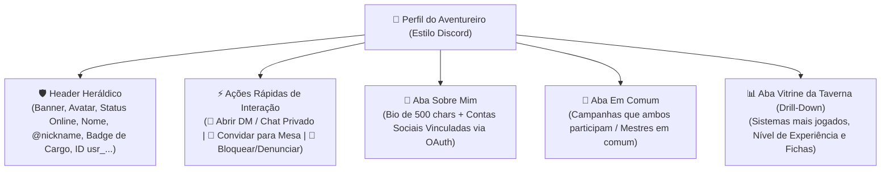

# ArcanaVTT — Módulo 03: Perfil Social (Estilo Discord), DMs 1-a-1 & Vitrine

---

## 👤 4. Perfil do Usuário, Vitrine Interativa, Contas Vinculadas & Chat Pessoal (Estilo Discord)

A experiência de **Perfil do Usuário e Interação Social** do ArcanaVTT é fortemente inspirada no modelo do **Discord**, combinando identidade heráldica, conexões sociais, métricas de jogo e comunicação direta entre aventureiros.

---

### 🛡️ 4.1. Visualização de Perfil de Outros Usuários (Modal / Bottom Sheet Estilo Discord)

Ao tocar no avatar ou `@nickname` de qualquer usuário (seja no lobby, no chat da campanha ou em buscas), abre-se a **Ficha de Perfil Social**:

1. **Cabeçalho & Identidade Visual:**
   - Banner estilizado e Avatar com indicador de presença (*Online*, *Em Jogo*, *Ausente*).
   - Nome de exibição em destaque e `@nickname` com botão de cópia rápida.
   - Badge Heráldico do Cargo oficial (`[Jogador]`, `[Mestre]`, `[Admin]`, `[Superadmin]`).
   - Data de ingresso na taverna.
2. **Barra de Ações Rápidas de Interação:**
   - 💬 **Botão "Enviar Mensagem Privada (Abrir DM)":** Abre imediatamente o canal de conversa direta 1-a-1 com o usuário.
   - 🤝 **Botão "Convidar para Campanha" (Exclusivo para Mestres):** Permite selecionar uma mesa liderada pelo Mestre e enviar convite com 1 toque.
   - 🚫 **Menu de Opções:** Bloquear usuário (impede mensagens e convites) ou Denunciar por conduta inadequada para a moderação Admin.
3. **Seção "Sobre Mim":**
   - Biografia (até 500 caracteres).
   - Selos verificados de **Contas Vinculadas** (Discord, Twitch, YouTube, Steam, Instagram, X/Twitter, Reddit) com links diretos.
4. **Seção "Em Comum" (*Mutuals*):**
   - Lista de campanhas ativas ou concluídas em que ambos participam juntos.

---

### 💬 4.2. Sistema de Mensagens Diretas (DMs / Chat Pessoal 1-a-1)

O ArcanaVTT inclui uma central de **Mensagens Diretas** no Hub principal:

- **🔒 Isolamento contra Terceiros & Acesso Supremo de Auditoria:**
  - O canal de DM é **estritamente isolado de outros jogadores, mestres de campanhas ou terceiros**: ninguém na comunidade tem visibilidade sobre a conversa.
  - **👑 Acesso do Superadmin:** Como autoridade máxima da plataforma, o **Superadmin** possui permissão de auditoria e leitura em todas as mensagens e DMs para garantir a segurança da plataforma e analisar denúncias de infrações.
  - No nível de banco (Cloudflare D1) e WebSockets, todas as consultas e eventos validam os participantes (`user_a` e `user_b`) ou a autenticação do Superadmin, bloqueando qualquer outro acesso com `403 Forbidden`.
- **Conversas Privadas em Tempo Real:** Comunicação fluida e instantânea entre os dois jogadores, sincronizada via WebSockets com criptografia em trânsito e persistida no Cloudflare D1.
- **Recursos do Chat Direto:**
  - Envio de mensagens de texto, formatação markdown simples e links;
  - Indicador de digitação em tempo real (*"digitando..."*) e confirmação de leitura;
  - 🎲 **Rolador de Dados Privado no Chat:** Possibilidade de rolar dados rápidos no chat privado (ótimo para testes pré-sessão ou conversas secretas);
  - Notificações de novas mensagens no aparelho.
- **Preferências de Recepção de DMs:** Nas *Configurações*, o usuário pode definir de quem aceita receber novas conversas privadas (*Qualquer usuário*, *Apenas membros de mesas em comum* ou *Ninguém / Apenas Amigos*).

---

### 🔗 4.3. Vinculação de Contas Externas (OAuth 2.0)

Em vez de campos manuais, a integração social utiliza autorizações OAuth 2.0 oficiais:

- **Provedores Suportados:** Discord, Twitch, YouTube, Instagram, X (Twitter), Steam e Reddit.
- **Garantia de Autenticidade:** O sistema puxa o identificador oficial verificado diretamente da plataforma conectada, exibindo selos nobres no perfil.

---

### 📊 4.4. Vitrine da Taverna (Métricas de Engajamento com Drill-Down Interativo)

O sistema calcula automaticamente o perfil de jogador do usuário:

1. **Sistemas de RPG Mais Jogados & Preferências:**
   - Ranking dinâmico dos sistemas mais jogados calculado pelo volume de campanhas e sessões.
2. **Nível de Experiência por Sistema:**
   - Classificação automática de proficiência: *Iniciante* (< 3 sessões), *Praticante* (3-10 sessões), *Veterano* (11-30 sessões), *Mestre do Sistema* (30+ sessões).
3. **Contadores Globais:**
   - Total de Campanhas como Jogador / Mestre, Total de Personagens Forjados e Sessões Jogadas.
4. **🔍 Navegação Detalhada (*Drill-Down* ao Clicar):**
   - Ao tocar em qualquer card de métrica, abre-se a lista detalhada com os registros correspondentes (histórico de sessões, fichas criadas ou campanhas daquele sistema).
