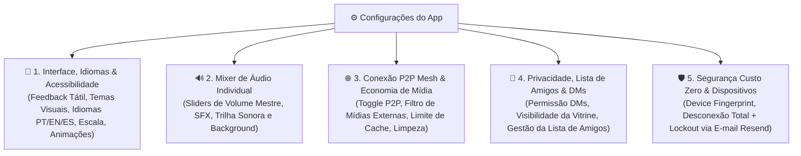

# ArcanaVTT — Módulo 04: Configurações, Acessibilidade, Mixer de Áudio, P2P & Lista de Amigos

---

## ⚙️ 5. Aba de Configurações, Acessibilidade, Rede P2P, Privacidade & Gestão de Dispositivos

Aba dedicada à personalização da interface, acessibilidade, mixers de áudio, governança de dados P2P Mesh, idiomas, privacidade social e segurança de sessões da conta no dispositivo móvel.

---

### 📱 5.1. Preferências de Interface, Idiomas & Acessibilidade Visual e Tátil

- **Idioma do Aplicativo (*Language & Region*):**
  - Seletor com 3 opções explícitas de idioma de interface: *Português do Brasil (PT-BR)* [Padrão Nativo], *Inglês (EN-US)* e *Espanhol (ES-ES)*.
- **Feedback Tátil / Vibração (*Haptic Feedback*):**
  - Seletor de intensidade com 4 opções explícitas: *Desativado*, *Suave*, *Médio* ou *Intenso* (para rolagens de dados, acertos críticos e toques no grid tático).
- **Temas Visuais da Taverna:**
  - Seletor de tema visual com 3 opções: *Modo Escuro Heráldico* (padrão), *Modo Alto Contraste para Luz Solar* e *Modo Economia de Bateria OLED* (pretos puros `#000000`).
- **Escala de Texto & Tipografia:**
  - Ajuste deslizante numérico da fonte (de *80% a 150%*) aplicado em tempo real em fichas de personagem, diários de bordo, menus e chats.
- **Redução de Movimentos & Animações:**
  - Toggle (*Ligado / Desligado*) para desativar animações e transições de tela em dispositivos de menor desempenho.

---

### 🔊 5.2. Mixer de Áudio Individual

- **Slider de Volume Mestre:** Controle numérico deslizante de 0% a 100% para o volume geral do aplicativo.
- **Slider de Efeitos Sonoros (SFX):** Controle independente de 0% a 100% para sons de rolagem de dados, ataques no grid tático, bombas no Mahjong e gatilhos sonoros de cenas.
- **Slider de Trilha Sonora / Ambiência:** Controle independente de 0% a 100% para faixas de música de fundo transmitidas pelo Mestre.
- **Silenciar em Segundo Plano:** Toggle (*Ligado / Desligado*) para pausar áudio e efeitos automaticamente ao minimizar o aplicativo.

---

### 🌐 5.3. Conexão P2P Mesh, Filtro de Segurança & Armazenamento Local

- **🖼️ Filtro de Segurança de Mídia Externa (*Safety Media Filter*):**
  - Seletor com 2 opções de exibição de imagens: *Exibir Todas as Imagens da Mesa (Oficiais e URLs Externas)* ou *Exibir Apenas Mídias Oficiais da Taverna* (substitui imagens de links externos inseridas por outros jogadores por ilustrações vetoriais padronizadas SVG para evitar a exibição de conteúdos indesejados).
- **Compartilhamento P2P Mesh:**
  - Toggle (*Ligado / Desligado*) para autorizar o envio e recebimento direto de mídias de cena, vetores SVG e pacotes homebrew entre dispositivos da taverna.
- **Modo de Dados Móveis para P2P & Mídias:**
  - Seletor com 2 opções: *Somente em Redes Wi-Fi* (padrão de economia) ou *Wi-Fi e Redes Móveis (4G/5G)*.
- **Limite de Cache P2P Mesh no Celular:**
  - Seletor com 4 opções de cota máxima de disco: *500 MB*, *1 GB*, *2 GB* ou *Sem Limite*.
- **Limpeza de Cache com 1 Toque:**
  - Botão destacado `[ 🧹 Limpar Cache de Mídias Locais ]` para liberar espaço em disco sem apagar campanhas ou fichas salvas localmente.

---

### 👥 5.4. Privacidade & Módulo de Gestão da Lista de Amigos

- **👥 Módulo Completo da Lista de Amigos do Aventureiro:**
  - *Localização:* Painel social no perfil, atalho na Top Bar e menu em Comunidades.
  - *Adicionar Amigo:* Envio de solicitação por `@nickname` único ou leitura de QR Code do perfil do aventureiro.
  - *Gerenciamento de Solicitações:* Painel com abas *Solicitações Recebidas* e *Solicitações Enviadas* com botões explícitos `[ Aceitar ]` e `[ Recusar ]`.
  - *Lista de Amigos Confirmados:* Exibição da lista de amigos com indicadores de presença (*Online*, *Em Jogo*, *Ausente*), atalho de 1 toque para abrir DM privada e botão `[ Convidar para Campanha ]`.
  - *Ações de Governança:* Opção de `[ Remover Amigo ]` ou `[ Bloquear Usuário ]`.
- **Permissão de Recebimento de Mensagens Diretas (DMs):**
  - Seletor de privacidade com 3 opções: *Qualquer Usuário da Taverna*, *Apenas Membros de Campanhas em Comum* ou *Apenas Amigos*.
- **Privacidade da Vitrine de Métricas:**
  - Seletor de visibilidade das estatísticas do perfil com 3 opções: *Público na Taverna*, *Apenas para Amigos* ou *Privado (Apenas Eu)*.
- **Visibilidade de Presença Social:**
  - Toggle (*Visível na Taverna / Oculto em Modo Offline*).
