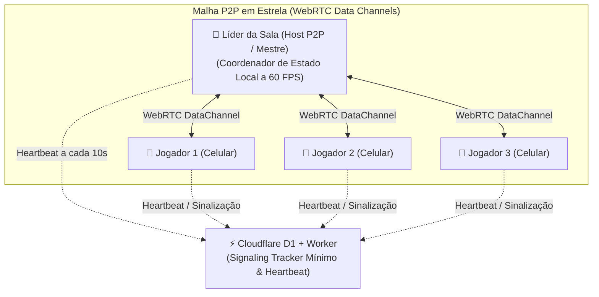

# ArcanaVTT — Módulo 07: Sistemas, Compêndio, Homebrews & P2P Mesh

---

## 📜 3. Sistemas (Catálogo, Compêndio & Motores de RPG)

- **Localização:** 3º item da Barra Inferior (Bottom Navigation Bar).
- **Finalidade:** Central mecânica do ArcanaVTT para consulta de regras oficiais livres, exploração de pacotes homebrews da comunidade, gestão de sistemas favoritos e criação de sistemas próprios.

```
┌────────────────────────────────────────────────────────┐
│ [Logo ArcanaVTT]               [🔍 Buscar] [➕ Forjar*]│ (Top Bar)
├────────────────────────────────────────────────────────┤
│  [ 📚 Oficiais ]  [ 🛠️ Próprios* ]  [ ⭐ Meus ]  [ 🌐 Comunidade ] │ (Segmentos)
├────────────────────────────────────────────────────────┤
│                                                        │
│ 🔍 BARRA DE PESQUISA & FILTRO DINÂMICO INTELIGENTE     │
│ [ 🔎 Buscar sistema, regra, magia, item, monstro... ]  │
│ Categorias: [ #grimorio ] [ #bestiario ] [ #armas ]    │
│ (Apenas categorias com conteúdos ativos são exibidas)  │
│                                                        │
│ 🌟 SISTEMA OFICIAL EM DESTAQUE (Licença Livre)         │
│ ┌────────────────────────────────────────────────────┐ │
│ │ 🛡️ ALPHAD6 SYSTEM (Oficial ArcanaVTT • Licença Livre)│ │
│ │ 📖 Motor nativo de parada de dados, ânima e relógios.│ │
│ │ 📦 Contém: 120 Itens • 45 Ameaças • 30 Habilidades   │ │
│ │ ⭐ 5.0 (Oficial) • 👥 2.8k Mesas Ativas              │ │
│ │ ────────────────────────────────────────────────── │ │
│ │ [ 📖 Livro de Regras ] [ 📄 Ficha ] [ 💾 Baixar ]   │ │
│ └────────────────────────────────────────────────────┘ │
│                                                        │
│ 📋 CATÁLOGO DE SISTEMAS & PACOTES HOMEBREW             │
│                                                        │
│ ┌────────────────────────────────────────────────────┐ │
│ │ ⚔️ D20 ARCANO (Fantasia Medieval • OGL Livre)      │ │
│ │ 📜 Nível, Classes, D20 + Modificador, CA e Magias  │ │
│ │ ⭐ 4.9 • 👥 1.4k Mesas • 💾 Disponível Offline      │ │
│ │ ────────────────────────────────────────────────── │ │
│ │ [ 📚 Compêndio ] [ 📋 Bestiário ] [ ⭐ Favoritar ]  │ │
│ └────────────────────────────────────────────────────┘ │
│                                                        │
│ ┌────────────────────────────────────────────────────┐ │
│ │ 📦 PACOTE HOMEBREW: "Grimório das Sombras v1.2"    │ │
│ │ 🔗 Vinculado a: AlphaD6 System • Categoria: Magias │ │
│ │ 👤 Criador: @mestre_cypher • ⭐ 4.8 (85 avaliações) │ │
│ │ 🌐 Rede P2P: 34 nós ativos • [ 📥 Baixar via P2P ] │ │
│ │ ────────────────────────────────────────────────── │ │
│ │ [ 👁️ Pré-visualizar ] [ 📥 Instalar no Sistema ]   │ │
│ └────────────────────────────────────────────────────┘ │
└────────────────────────────────────────────────────────┘
```

---

### 🧩 Módulos, Regras & Componentes da Tela de Sistemas

- **📑 As 4 Sub-Abas de Segmentação:**
  1. **📚 Oficiais (Licença Livre Exclusiva):**
     - Catálogo de sistemas desenvolvidos ou adaptados oficialmente pela equipe do ArcanaVTT, utilizando **estritamente documentos de licença aberta/livre** (ex: AlphaD6 nativo, D20 sob licença OGL/ORC, Creative Commons CC-BY).
     - Conteúdo 100% verificado, homologado e sincronizado de fábrica.
  2. **🛠️ Sistemas Próprios (Criador Completo):**
     - Área destinada à criação de novos sistemas de RPG independentes pelo usuário.
     - **Sistema de Chave (*Key*):** A criação de sistemas próprios do zero requer uma *Key de Criação* adquirida pelo usuário (mecanismo a ser detalhado na fase de monetização).
  3. **⭐ Meus Sistemas:**
     - Agrupador pessoal de todos os sistemas criados pelo próprio usuário e sistemas oficiais/comunitários que ele **favoritou/salvou** para acesso rápido e criação de campanhas.
  4. **🌐 Comunidade (Homebrews, Compêndio & Pacotes de Conteúdo):**
     - Hub social onde a comunidade compartilha **Pacotes Homebrew** estruturados nos **5 tipos fundamentais de compêndio**:
       1. *🧪 Itens Consumíveis:* Poções, ferramentas, kits utilitários e suprimentos;
       2. *⚔️ Equipamentos & Armas:* Armas brancas, armas de fogo, armaduras e escudos;
       3. *🐉 Criaturas & NPCs:* Bestiário completo com fichas de ameaças e aliados;
       4. *✨ Poderes & Magias:* Grimórios arcanos, dons sobrenaturais e rituais;
       5. *📜 Pistas, Segredos & Lore:* Relíquias narrativas e enigmas investigativos.
     - **Herança Delta & Esqueletos Padronizados:** Todo pacote homebrew é baseado em deltas leves sobre o sistema base, aproveitando os esqueletos de dados padronizados e a biblioteca de assets vetoriais universais (SVG transparente com personalização dinâmica de cor por CSS).
     - **Filtro Dinâmico Inteligente de Categorias:** As homebrews utilizam as mesmas categorias da *Oficina do Mestre*. **Regra estrita de UX:** categorias que não possuam nenhum conteúdo criado ficam automaticamente ocultadas do menu de filtros para não poluir a interface com buscas vazias.

- **⭐ Métricas de Qualidade & Download Offline:**
  - Avaliação comunitária por estrelas (1 a 5 ⭐), quantidade de avaliações e contador em tempo real de mesas ativas utilizando o sistema/pacote.
  - **Botão `[ 💾 Baixar / Disponibilizar Offline ]`:** Permite armazenar o sistema ou pacote homebrew localmente no dispositivo para consulta sem oscilações de conexão.

- **🛡️ Sanitização Rígida de Dados (Anti-XSS & Anti-Injeção):**
  - **Validação de Entrada:** Todo texto, descrição de perícia, fórmula matemática de rolagem e campo personalizado inserido por mestres/criadores passa por sanitização profunda no cliente e na borda (Cloudflare Worker).
  - Bloqueio estrito de tags HTML executáveis (`<script>`, `<iframe>`, `onerror=`), caracteres de escape maliciosos e injeções de código em parsers de expressões matemáticas.

---

### 🌐 Arquitetura de Distribuição Híbrida P2P (*Mesh Distribution*) & Diretriz Transversal

- **MANDATO DE ARQUITETURA:** A viabilidade da tecnologia P2P Mesh (transferência direta ponto a ponto entre dispositivos) deve ser **pesada e avaliada em cada função e módulo do projeto**, com o objetivo de maximizar o uso dessa tática ao limite operacional e manter o custo de nuvem nulo.
- **Módulos com Aplicação P2P Mesh:**
  1. **Pacotes Homebrew & Compêndios Comunitários:** Download de arquivos de regras, monstros, armas, magias e tabelas diretamente dos aparelhos de outros usuários que já possuem o conteúdo baixado.
  2. **Mídias de Cenas & Assets Visuais:** Transferência direta de mapas de fundo em alta resolução, tokens personalizados de personagens, ilustrações de diários e ícones SVG vetoriais entre os membros da mesa.
  3. **Faixas de Áudio & Trilhas Sonoras:** Streaming P2P direto do dispositivo do Mestre para os Jogadores para faixas de música e efeitos sonoros SFX.
  4. **Sincronização de Estado de Cena em Tempo Real:** Comunicação direta P2P WebSockets/WebRTC entre os aparelhos dos jogadores conectados à mesma sessão (movimento de tokens no Grid Tático 2D, cliques no Mahjong, Puzzles e mensagens do Chat da Mesa).

---

### 📡 Método de Sincronização P2P: Eleição de Líder Dinâmica & Topologia Estrela

Para viabilizar **multiplayer em tempo real a 60 FPS com Custo Zero de infraestrutura**, o ArcanaVTT resolve a limitação dos planos gratuitos de computação em nuvem através de uma malha P2P inteligente:



1. **A Barreira de Custo Zero Superada:**
   - O plano gratuito do Cloudflare Workers não suporta *Durable Objects* nem transmissão persistente contínua (*broadcast*) de WebSockets sem custos.
   - **Solução Arquitetural:** O banco Cloudflare D1 e os endpoints do Worker (`/api/sync/presence` e `/api/sync/signal`) atuam exclusivamente como **Signaling Tracker leve** para troca de ofertas SDP, respostas e *ICE Candidates*, além de registro de batimentos de presença (*Heartbeat* a cada 10s).
2. **Eleição Dinâmica de Líder (*Dynamic Leader Election*):**
   - Ao iniciar ou entrar em uma sessão de campanha, os clientes consultam o estado de presença.
   - O Mestre da campanha é prioritariamente eleito como o **Líder da Sala (Host P2P)**. Caso o Mestre não esteja presente (em campanhas no modo *Free Time*), o cliente com menor latência / maior tempo de conexão assume a coordenação.
   - O Líder atua como o ponto focal da topologia em estrela para a ordenação rápida dos eventos da partida.
3. **Comunicação Direta via WebRTC Data Channels:**
   - Uma vez estabelecida a conexão P2P entre os aparelhos, toda movimentação de tokens no grid tático, rolagens de dados no chat, cliques em blocos de Mahjong e digitação no terminal trafegam diretamente de celular para celular.
   - Garante latência mínima (< 30ms na mesma região), economia de 100% de largura de banda do servidor e suporte a 60 FPS fluídos.
4. **Resiliência & Auto-Re-eleição sem Queda de Sessão:**
   - Caso o Líder sofra uma oscilação na rede móvel (4G/5G) ou feche o aplicativo, os nós conectados detectam a perda de batimento em milissegundos e executam imediatamente uma **nova eleição de líder** entre os jogadores ativos remanescentes, mantendo o estado da cena em memória e transferindo a liderança sem interromper a sessão.
5. **Fallback Autônomo de Polling (Tolerância a CGNAT/Firewall):**
   - Caso um jogador esteja conectado sob uma rede móvel com CGNAT simétrico severo ou firewall corporativo que bloqueie o pareamento WebRTC direto (sem servidor TURN pago):
   - O aplicativo mobile Flutter detecta a falha de conexão P2P e ativa automaticamente um **fallback autônomo de polling leve** (a cada 3.5 segundos) diretamente contra o endpoint do Cloudflare Worker, garantindo que nenhum aventureiro fique impedido de jogar.

- **Moderação & Promoção Oficial no Servidor:** Para mitigar riscos jurídicos (copyright/pirataria) e conteúdos abusivos, nenhum conteúdo da comunidade é salvo nos servidores centrais do ArcanaVTT de forma automática. Um pacote só passa a residir de forma permanente na nuvem após **análise e aprovação manual de um Admin ou Superadmin** no Painel de Administração.

- **🔬 Nota de Projeto (Anatomia do Sistema & Lookup Rápido):**
  - A anatomia detalhada dos blocos mecânicos de um sistema e o motor de *Lookup Rápido em Sessão* serão detalhados em tópicos próprios dedicados do planejamento.
