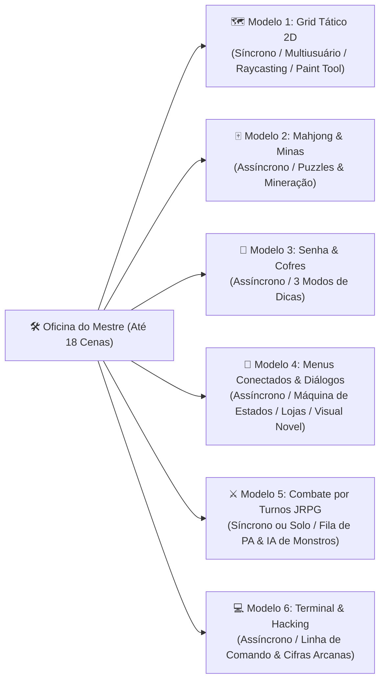
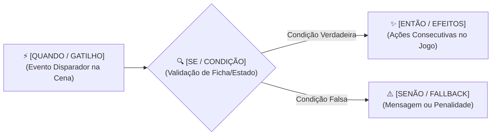

# ArcanaVTT — Módulo 09: Os 6 Modelos de Cenas Interativas, Ferramentas de Oficina & Gatilhos No-Code

---

## 🎭 8. Os 6 Modelos de Cenas Interativas & Arquitetura da Oficina

O grande diferencial tecnológico e de experiência do ArcanaVTT é sua capacidade de alternar instantaneamente entre **6 modelos de cenas interativas** durante a sessão, permitindo que o Mestre crie masmorras dinâmicas, quebra-cabeças, menus complexos e combates sem escrever código:

---

### 🛠️ 8.1. Arquitetura da Oficina de Criação de Cenas (Tooling & Gestão)

1. **Capacidade Rígida (Até 18 Cenas por Campanha):**
   - Para otimizar o banco SQLite / Cloudflare D1 e economizar memória no celular dos jogadores, cada campanha gerencia até **18 cenas no total** (ativas + rascunhos).
   - O cabeçalho da gaveta lateral exibe o medidor de slots em tempo real (ex: `12 / 18 Cenas Criadas`).
2. **Chave On/Off de Visibilidade da Cena:**
   - **🟢 Ativa (ON):** A cena é distribuída via P2P Mesh e fica acessível para os jogadores no palco.
   - **🔴 Oculta / Rascunho (OFF):** A cena permanece em preparação na Oficina, 100% invisível para os jogadores.
3. **Seletor de Modo Duplo no Editor (*Editor vs Visualizador*):**
   - **Modo Editor:** Ambiente completo de construção visual, pintura de grid, configuração de regras e amarração de gatilhos.
   - **Modo Visualizador (*Playtest Sandboxed*):** Permite ao Mestre simular e testar a cena no próprio aparelho exatamente como o jogador a vivenciará (testando colisões, lógica de puzzles, árvores de diálogo e gatilhos no-code localmente antes de liberar para a mesa).

---

### 🗺️ Modelo 1: Grid Tático 2D (Combate Posicional, Exploração & Colisão)

- **Natureza:** Síncrono (múltiplos jogadores conectados em tempo real via P2P Mesh a 60 FPS).
- **Estrutura de Matriz:** Grade 2D configurável (largura x altura até 500 células) renderizada no Flutter via `CustomPainter` de alta eficiência com descarte de elementos fora da tela (*Viewport Culling*).
- **Sistema de 3 Camadas Visuais (Layers):**
  - *Layer 1 (Chão/Fundo):* Terreno base onde entidades e jogadores passam livremente por cima (pisos de pedra, grama, água rasa, tapetes, estradas).
  - *Layer 2 (Obstáculos & Colisão Física):* Mesmo plano físico das entidades. Bloqueia movimentação, passagem e linha de visão (paredes maciças, rochas, portas trancadas, outros tokens).
  - *Layer 3 (Sobreposição & Teto):* Elementos aéreos onde as entidades passam por baixo visualmente (copas de árvores, telhados de casas, vigas suspensas, pontes elevadas).
- **🎨 Ferramenta de Pintura de Grid na Oficina (*Tile Paint Engine*):**
  - **Barra de Ferramentas:** Pincel de célula individual, Borracha (*Eraser*), Balde de Preenchimento (*Flood Fill*) e Conta-gotas de terreno (*Eyedropper*).
  - **Paleta de Assets Vetoriais SVG:** Biblioteca de assets leves transparentes com personalização dinâmica de cor de borda/preenchimento via CSS.
  - **Propriedades Físicas por Célula da Layer 2:** Chaves configuráveis para definir se o obstáculo é *Destrutível* (removido via gatilho), se é uma *Porta Trancada* ou se bloqueia/permite passagem de luz da visão dinâmica.
- **🚫 Regra Global de Não-Sobreposição de Tokens (Colisão Rígida):**
  - Dois tokens **nunca podem ocupar a mesma célula do grid** simultaneamente. A tentativa de arrastar um token para um tile já ocupado é sumariamente rejeitada pelo motor de colisão do cliente (*Snap Back*).
  - *Exceções de Regra:* Montarias (cavaleiro acopla no token da montaria), itens soltos no chão, poças de sangue ou efeitos mágicos que ocupem o mesmo tile.
- **🧲 Alinhamento Magnético (*Snap to Grid*):**
  - Ao soltar o token na tela, o sistema calcula a célula mais próxima e realiza o alinhamento magnético instantâneo no centro do tile nos eixos X e Y.
- **👁️ Linha de Visão Dinâmica (*Raycasting*) & Neblina de Guerra (*Fog of War*):**
  - Raios de visão partem do token do jogador e são bloqueados geometricamente por polígonos presentes no Layer 2. O Mestre possui pincel para revelar/ocultar setores manualmente.
- **🎮 Controles Mobile & Movimentação:**
  - **Gamepad Virtual Analógico:** Joystick flutuante no canto inferior para navegação ágil.
  - **Toque Direto (*Tap-to-Move*):** Toque na célula de destino com cálculo de rota inteligente (*Pathfinding*) desviando de obstáculos do Layer 2.
  - **Suporte a Teclado no PC:** Movimentação via teclas `WASD` ou Setas direcionais.
- **⚡ Gatilhos No-Code de Célula:**
  - Células programáveis que disparam ações ao serem pisadas ou clicadas (*on_tile_step*, *on_tile_click*).

---

### 🀄 Modelo 2: Mahjong, Memória & Campo Minado (Mineração, Puzzles & Relíquias)

- **Natureza:** Assíncrono (1 jogador por vez na cena).
- **Mecânica Híbrida:** Integra a concentração do Mahjong, o desafio mnemônico do Jogo da Memória e o risco letal do Campo Minado.
- **📐 Painel de Configuração na Oficina:**
  - *Dimensões do Tabuleiro:* Pequeno (4x4 = 16 blocos), Médio (6x6 = 36 blocos) ou Grande (8x8 = 64 blocos).
  - *Configurador de Bombas:* Quantidade de bombas distribuídas e fórmula de dano em HP/Ânima (ex: dano fixo de 5 PV ou 1d6 de fogo).
  - *Tabela de Recompensas:* Associação de pontuação acumulada a entregas de itens do compêndio, minérios ou moedas.
- **Ciclo de Jogo & Revelação Inicial:**
  - No início da cena, todos os blocos do tabuleiro são exibidos revelados por 3 a 5 segundos (memorização).
  - Ao formar o primeiro par válido de peças, todos os blocos restantes se ocultam imediatamente sob o símbolo de interrogação `?`.
  - Cada símbolo está vinculado a um número secreto sorteado na inicialização da cena.
- **💣 Bombas (Peças Vermelhas / Fundo Lilás):**
  - Se o jogador tocar em uma peça bomba, ela detona e causa dano direto à ficha do personagem.
- **Recompensas & Reinício Contínuo:**
  - Formar pares acumula pontos. Se o jogador limpar todas as peças que não são bombas, o tabuleiro é limpo e reinicia uma nova rodada **mantendo os pontos e vida acumulados**, permitindo mineração progressiva de alto risco.

---

### 🔐 Modelo 3: Senha & Mecânica de Cofre (Desafio Lógico Rúnico)

- **Natureza:** Assíncrono (1 jogador por vez na cena).
- **Mecânica:** Desafio de decodificação estilo *Mastermind / Cofre de Segredos*.
- **📐 Painel de Configuração na Oficina:**
  - *Quantidade de Slots:* De 3 a 6 slots configuráveis.
  - *Tipos de Símbolos:* Números decimais (0-9), Letras do alfabeto ou Ícones Rúnicos SVG.
  - *Geração da Chave:* Combinação fixa do Mestre ou aleatória a cada novo acesso.
  - *Limite de Tentativas:* Número máximo de chances (ex: 3 a 5) antes de travar ou acionar alarme.
- **Dicas Visuais & 3 Modos de Feedback Cromático:**
  1. **Dica Textual Livre:** Mensagem enigmática ou pista escrita pelo Mestre.
  2. **Dica Matemática Global (Calor na Moldura do Cofre):** Cada símbolo possui um peso numérico. O sistema calcula a soma/multiplicação da tentativa contra a chave:
     - *Vermelho:* Valor inserido está acima da meta secreta ("muito quente / excesso");
     - *Azul:* Valor inserido está abaixo da meta ("frio / falta");
     - *Dourado:* Combinação 100% correta.
  3. **Semáforo Preciso por Slot Individual:** Cada slot indica seu alinhamento individual:
     - *Vermelho:* Símbolo selecionado está acima do correto;
     - *Azul:* Símbolo selecionado está abaixo do correto;
     - *Verde:* Símbolo 100% exato naquele slot.
- **Consequências:** Cada erro pode causar dano elétrico/mecânico. Acertos entregam itens, destrancam passagens ou disparam transição de cena.

---

### 💬 Modelo 4: Menus Conectados, Diálogos & Interfaces Hipermidiáticas

- **Natureza:** Assíncrono (1 jogador por vez ou exploração solo).
- **CONCEITO EXPANDIDO — Máquina de Estados de Múltiplos Menus Conectados:**
  - Uma poderosa **máquina de estados visual baseada em nós interconectados (Node Graph)** para emular interfaces de jogos clássicos, lojas, livros-jogos e painéis de controle de masmorras.
- **Casos de Uso Versáteis:**
  1. *Árvores de Diálogo (Visual Novel / NPC):* Conversas ramificadas com orador, retratos e opções de resposta;
  2. *Lojas & Mercadores:* Telas de comércio com catálogo de itens, preços em moedas e compra automática;
  3. *Painéis de Mecanismos:* Botões, alavancas e válvulas para drenar água ou abrir comportas da masmorra;
  4. *Livro-Jogo & Investigação:* Leitura de manuscritos antigos e inspeção de detalhes de pistas;
  5. *Seleção de Rotas:* Escolha de trilhas em viagens com encontros aleatórios.
- **📝 Anatomia do Construtor No-Code na Oficina:**
  - Cada tela é um **Nó (Node)** contendo: ID do Nó, Título/Orador, Retrato SVG/Imagem, Texto Descritivo e Botões de Opção.
- **🔀 Condicionais No-Code nas Opções:**
  - Travas automáticas: *Checagem de Atributo/Perícia*, *Posse de Item no Inventário* ou *Status de Flag da Campanha*.
- **⚡ Gatilhos de Consequência:**
  - Débito/crédito de moedas, entrega/remoção de itens, dano, transição para Combate JRPG ou retorno ao Grid 2D.

---

### ⚔️ Modelo 5: Combate por Turnos Clássico (Estilo JRPG)

- **Natureza:** Síncrono (com o grupo conectado via P2P Mesh) ou Solo (contra monstros pré-programados).
- **Mecânica Visual:** Batalha por turnos estilo *Final Fantasy / Pokémon*, posicionando heróis de um lado e monstros do compêndio do outro.
- **🎲 Fila de Iniciativa Autoritativa & Pontos de Ação (PA):**
  - Geração de Fila de Turnos ordenada visualmente. No seu turno, o combatente consome PA para:
    - *Ataque Básico* (1 PA);
    - *Habilidade Especial / Magia* (2 a 3 PA + custo de energia/mana);
    - *Uso de Consumível / Poção* (1 PA);
    - *Defesa / Esquiva Antecipada* (1 PA, concede bônus de reação até o próximo turno).
- **🤖 Automação de NPCs & Rotinas de IA Local:**
  - Árvores de decisão pré-programadas pelo Mestre na Oficina (*ex: Berserker ataca menor HP; Conjurador usa magia de área se alvos >= 2; Defensivo usa escudo se HP < 30%*).
  - Execução local no Líder da Sala validada pelo árbitro autoritativo.

---

### 💻 Modelo 6: Terminal & Hacking Arcano

- **Natureza:** Assíncrono (1 jogador por vez na cena).
- **Mecânica:** Interface de console retrô monocromática CRT com prompt de linha de comando (`> `).
- **⌨️ Dicionário de Comandos `If-Then` na Oficina:**
  - O Mestre cadastra comandos e scripts de resposta:
    - `IF comando == "STATUS" THEN exibe: "Defesas arcanas ativas no Nível 3"`;
    - `IF comando == "OVERRIDE" THEN dispara gatilho: destranca porta no Grid 2D`;
    - `IF comando == "HELP" THEN exibe lista de comandos básicos`.
- **🔤 Alfabetos Temáticos Customizados & Cifras:**
  - Fontes temáticas integradas: *Runas Arcanas, Cifras Alienígenas, Binário, Hexadecimal ou Língua Antiga*.

---

## ⚡ 9. Motor Universal No-Code de Gatilhos & Automação (`[QUANDO] ➔ [SE] ➔ [ENTÃO]`)

O grande pilar de dinamicidade do ArcanaVTT é o seu **Motor Universal No-Code**, que permite aos Mestres conectarem qualquer modelo de cena ao inventário das fichas, ao diário de missões, a outras cenas e aos blocos visuais dos NPCs sem escrever código:

### 🧩 9.1. Anatomia do Construtor Visual No-Code na Oficina do Mestre

1. **Bloco `[QUANDO]` (Evento Disparador / Trigger):**
   - *No Grid Tático 2D:* `Ao Clicar no Tile` | `Ao Pisar no Tile` | `Ao Mover Token para Célula`.
   - *No Mahjong & Minas:* `Ao Formar Par` | `Ao Detonar Bomba` | `Ao Atingir Pontuação X` | `Ao Limpar Tabuleiro`.
   - *No Cofre / Senhas:* `Ao Inserir Combinação Correta` | `Ao Errar Tentativa` | `Ao Esgotar Tentativas`.
   - *Nos Menus Conectados:* `Ao Escolher a Opção X` | `Ao Comprar Item Y` | `Ao Chegar no Nó Z`.
   - *No Combate JRPG:* `Ao Iniciar Rodada` | `Ao Derrotar Inimigo` | `Ao Ficar com HP < 20%`.
   - *No Terminal:* `Ao Enviar o Comando Exato X` | `Ao Digitar Comando Incorreto`.
   - *Gerais da Campanha:* `Ao Zerar HP/Ânima` | `Ao Chegar na Data/Hora X do Relógio`.
   - **🎯 Ferramenta de Seleção de Alvo (`Capturar Alvo`):** No modo editor, o Mestre clica no botão com mira e toca diretamente no tile $(X, Y, \text{Layer})$ ou nó do menu, preenchendo as coordenadas automaticamente.

2. **Bloco `[SE]` (Condições & Validações Opcionais):**
   - `Possui Item no Inventário` (ex: ter `Chave_Ferro_01` $\ge 1$).
   - `Atributo ou Perícia Mínima` (ex: `Força >= 3` ou `Ladinagem >= 2`).
   - `Quantidade de Moedas` (ex: `Saldo >= 50P`).
   - `Reputação com Facção` (ex: `Reputação_Guilda >= +25`).
   - `Status de Evento Anterior` (ex: `Flag "boss_derrotado" == true`).
   - `Sem Condição` (dispara incondicionalmente).

3. **Bloco `[ENTÃO]` (Ações & Efeitos Encadeados):**
   - 🔄 `Alterar Tile / Entidade:` Modifica o asset ou estado de uma célula do Grid (ex: transforma baú trancado em baú aberto).
   - 🗑️ `Remover Obstáculo:` Deleta paredes/portas do Layer 2 tornando o tile transitável.
   - 🎒 `Entregar / Remover Item:` Credita ou debita equipamentos e consumíveis diretamente no inventário da ficha.
   - ✨ `Conceder XP / Moedas:` Concede experiência ou saldo de dinheiro ao aventureiro.
   - 💥 `Causar Dano / Curar HP:` Aplica dano de armadilha ou restaura pontos de vida/ânima na ficha.
   - 🚪 `Teleportar para Outra Cena:` Transfere o jogador ou todo o grupo para uma nova cena da campanha (`transfer_scene`).
   - 👁️ `Alterar Visibilidade de Bloco:` Torna visível um bloco visual secreto de NPC ou monstro.
   - 📜 `Registrar no Diário:` Grava uma entrada narrativa automática no histórico oficial da mesa.
   - 💬 `Exibir Toast / Alerta:` Emite uma notificação visual na tela do jogador.

---

### 🛡️ 9.2. Execução Autoritativa & Sincronização em Tempo Real (Zero-Trust)

1. **Validação na Borda (Cloudflare Worker / SQLite D1):**
   - As requisições de gatilho são enviadas como ações semânticas: `apiClient.sync('scenes.triggerAction', { sceneId, triggerType, params })`.
   - O backend busca a ficha real no banco de dados e valida se as condições do bloco `[SE]` são verdadeiras antes de executar os efeitos.
2. **Propagação P2P Mesh Instantânea a 60 FPS:**
   - Em cenas síncronas (Grid 2D e Combate JRPG), assim que o backend confirma a ação, o Líder da Sala despacha um pacote leve `scene_state_patch` via **WebRTC Data Channels** para todos os nós conectados na sala, garantindo que portas abertas, baús saqueados e monstros derrotados se atualizem simultaneamente na tela de todos os celulares sem delay perceptível.
