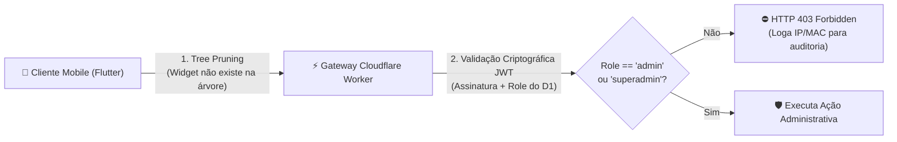

# ArcanaVTT — Módulo 11: Painel de Administração & Blindagem Zero-Trust

---

## 🛡️ 7. Administração (Painel Restrito a Admins e Superadmin)

- **Localização:** Item na Gaveta Lateral de Navegação (Navigation Drawer), renderizado **exclusivamente** para contas autorizadas com role `admin` ou `superadmin`.

---

### 🧩 Módulos Exaustivos do Painel de Administração

1. **📊 Sub-módulo 1 — Telemetria Global & Monitoramento P2P Mesh:**
   - Métricas em tempo real: Total de usuários cadastrados, campanhas ativas, sessões ao vivo no momento e consumo de recursos no Cloudflare Worker/D1;
   - Painel da Rede P2P Mesh: Monitoramento do número de nós ativos, volume de tráfego transferido P2P entre aparelhos e estimativa de largura de banda economizada.

2. **🚨 Sub-módulo 2 — Central da Fila da Denúncia Universal (*Global Report Queue*):**
   - Fila de atendimento contendo todas as denúncias enviadas pelos usuários nos 7 grupos de conteúdo (Perfis, Chats/DMs, Campanhas, Fichas, Compêndio, Sistemas/Homebrews, Guildas/Clãs);
   - **Visualização com Tags Automáticas de Contexto:** Cada item na fila exibe em destaque a tag de entidade gerada pelo sistema (`[🏷️ TIPO: USUÁRIO]`, `[🏷️ TIPO: MENSAGEM_CHAT]`, `[🏷️ TIPO: CAMPANHA]`, `[🏷️ TIPO: FICHA_PERSONAGEM]`, `[🏷️ TIPO: SISTEMA_RPG]`, `[🏷️ TIPO: PACOTE_HOMEBREW]`, `[🏷️ TIPO: GUILDA]`, `[🏷️ TIPO: CLÃ]`, `[🏷️ TIPO: TOPICO_FORUM]`, `[🏷️ TIPO: ARTIGO_WIKI]`);
   - **Visualização do Pacote de Evidências:** Transcrição do conteúdo, justificativa do denunciante, tag da infração (`#conteudo-improprio`, `#discurso-de-odio`, `#pirataria`, `#assedio`, `#spam`), carimbo de data/hora, identificadores da conta e telemetria de hardware (*Device Fingerprint*);
   - **Painel de Avaliação de Infração & Votação Colegiada:**
     - Punições leves (advertência ou despublicar conteúdo) podem ser executadas individualmente por 1 moderador;
     - **Regra Rígida de Votação Majoritária:** Punições graves (suspensão temporária ou banimento definitivo por hardware) são enviadas para votação no Painel de Infração e exigem o **voto majoritário favorável de no mínimo 3 Admins** OU a **decisão direta e imediata do Superadmin**.

3. **👥 Sub-módulo 3 — Auditoria de Identidade, Gestão de Usuários & Banimento:**
   - Ferramenta de busca por `@nickname`, ID interno `usr_...` ou hardware fingerprint;
   - Visualização de dados restritos de auditoria: **Endereço de e-mail privado vinculado ao OAuth (ex: `usuario@gmail.com`)**, carimbo de data/hora do último login, IP de acesso e histórico de punições;
   - Aplicação de sanções: Suspensão por prazos explícitos (24 horas, 7 dias, 30 dias) ou **Banimento Definitivo por Hardware** (inserção de MAC, Hardware UUID e DRM Widevine ID na lista negra do banco D1).

4. **👻 Sub-módulo 4 — Modo Espectador Invisível (*Ghost Spectator*):**
   - **Escopo do Modo Espectador:** Permite que Admins e Superadmins ingressem em qualquer campanha ao vivo, cena, chat de comunidade, guilda, clã ou fórum (**EXCETO conversas privadas e DMs 1-a-1**, que são estritamente isoladas e confidenciais);
   - **👁️ Indicador Exclusivo de Autoridade (Invisível para Jogadores):** Quando um Admin/Superadmin ativa o Modo Espectador, um badge/indicativo especial `[ 👻 ADMIN ESPECTADOR: @nome ]` fica **visível EXCLUSIVAMENTE para outros Admins e Superadmins** no painel de administração, informando quem está inspecionando a sessão e qual conteúdo está sendo acessado; para os jogadores e mestres da mesa, a presença é 100% invisível;
   - **Trava de Não-Interferência:** Nesse modo, o moderador **NÃO pode interagir com o jogo** (botões de envio de chat da mesa, rolagens de dados e movimentação no grid tático ficam completamente desativados);
   - **Denúncia Direta em Modo Ghost:** O moderador pode **executar denúncias diretas** de conteúdos, mensagens, grupos ou usuários diretamente durante a fiscalização, encaminhando o caso imediatamente para o Painel de Avaliação de Infração para votação colegiada dos Admins.

5. **👑 Sub-módulo 5 — Governança Suprema (Exclusivo do Superadmin):**
   - *Gestão de Administradores:* Concessão ou revogação do cargo de `Admin` para outros usuários;
   - *Auditoria Total de Comunicações:* Leitura e análise do histórico de conversas e DMs privadas 1-a-1 mediante denúncias graves;
   - *Infraestrutura & Banco D1:* Acesso direto aos schemas de banco, migrações SQL, chaves de API e painel de faturamento.

---

### 🚪 Procedimento de Logout (Sair)

- **Localização:** Botão fixo no rodapé da Gaveta Lateral de Navegação (Navigation Drawer).
- **Procedimento Exaustivo de Execução:**
  1. **Revogação no Backend:** Chama o endpoint no Cloudflare Worker para invalidar a assinatura JWT da sessão ativa;
  2. **Sanitização Criptográfica Local:** Remove todas as chaves e tokens salvos no *Android Keystore* via `flutter_secure_storage`;
  3. **Limpeza de Estado de Memória:** Reseta os controllers de estado, caches locais e variáveis em memória do aparelho;
  4. **Navegação Segura:** Redireciona o aplicativo imediatamente para a Tela Splash de Autenticação OAuth.

---

### 🔒 6.2. Protocolo de Blindagem Total do Módulo de Administração

Para tornar **completamente impossível** que um usuário malicioso (mesmo com aplicativo modificado, engenharia reversa de APK ou injeção de pacotes) acerte qualquer dado administrativo:

1. **Camada 1 — Poda de Árvore no Flutter (*Widget Tree Pruning*):**
   - O botão do Painel Admin e suas rotas visuais **não são apenas escondidos por CSS ou opacidade**; eles **não são instanciados na memória** se a propriedade `user.role` for diferente de `admin` ou `superadmin`.
2. **Camada 2 — Barreira Autoritativa no Backend (*Zero-Trust API Gateway*):**
   - Todos os endpoints administrativos (`/api/admin/*`) são protegidos por um middleware rigoroso no Cloudflare Worker.
   - O servidor não confia no que o cliente envia: ele valida a assinatura criptográfica do JWT contra a chave mestra e consulta diretamente a role do usuário no banco D1.
   - Se um usuário comum tentar forjar requisições manuais para endpoints de admin, a chamada é rejeitada na primeira linha com `HTTP 403 Forbidden` e o evento gera um alerta de segurança imediato com registro do IP e *Device Fingerprint*.
3. **Camada 3 — Zero Payload Leakage:**
   - Nenhuma informação, dado estatístico ou rota administrativa é trafegada nas respostas normais da API do usuário comum.
