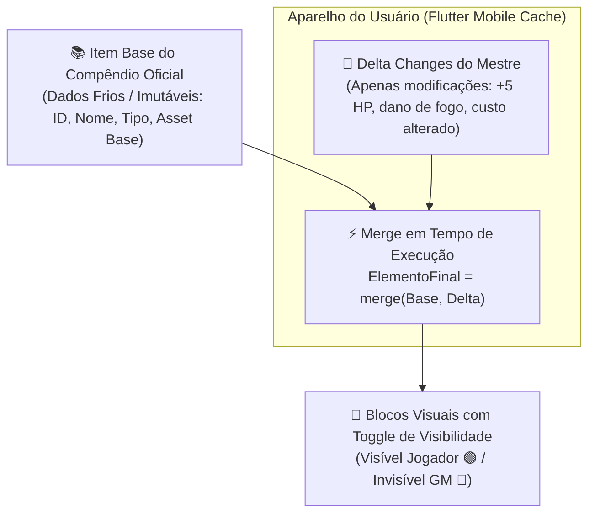

# ArcanaVTT — Módulo 12: Gerenciamento de Compêndio, Herança Delta & Áudio P2P

---

## 🏛️ 7. Arquitetura Modular de Compêndio (5 Tipos, Herança Delta & Esqueletos de Dados)

O **Compêndio** funciona como a biblioteca central e reutilizável de dados da campanha e do universo do jogo. Ele é estruturado para garantir consumo nulo de banda, latência zero em celulares Android e armazenamento ultraleve no Cloudflare D1 através do modelo de **Herança Delta** e **Blocos Visuais No-Code**:



---

### 📚 7.1. Os 5 Tipos Fundamentais de Elementos

O Compêndio gerencia categoricamente **5 tipos fundamentais de entidades**:

1. **🧪 Itens Consumíveis / Gerais:** Poções de cura, elixires, rações de viagem, tochas, cordas, gazuas, ferramentas de ofício, munições e suprimentos.
2. **⚔️ Equipamentos & Armas:** Armas brancas, armas de fogo/distância, armaduras leves/médias/pesadas, escudos, trajes especiais e acessórios mágicos (anéis, amuletos).
3. **🐉 Criaturas / NPCs / Entidades:** Bestiário de monstros, ameaças, aliados da guilda, PNJs de cidades e chefes de masmorra.
4. **✨ Poderes / Habilidades / Magias:** Técnicas ativas, habilidades passivas, magias arcanas, rituais e dons sobrenaturais.
5. **📜 Pistas / Segredos / Lore:** Fragmentos de documentos, cartas cifradas, itens de enigma, segredos investigativos e relíquias de lore.

---

### 📊 7.2. Esqueletos Base de Dados (*Data Schemas* Padronizados)

Cada um dos 5 tipos possui um esqueleto de dados pré-definido e padronizado no SQLite/Cloudflare D1 e no estado local do Flutter:

```json
// 1. Esqueleto de Item Consumível
{
  "id": "item_pocao_cura_menor",
  "name": "Poção de Cura Menor",
  "type": "item",
  "base_asset_id": "svg_potion_small",
  "blocks": {
    "bloco_uso": { "label": "Modo de Uso", "value": "1 Ação (Ingerir)", "is_visible": true },
    "bloco_qtd": { "label": "Doses / Quantidade", "value": 3, "is_visible": true },
    "bloco_efeito": { "label": "Efeito Mecânico", "value": "Restaura 1d6 + 2 de Vida/Ânima", "is_visible": true },
    "bloco_custo": { "label": "Custo em Moedas", "value": "50P", "is_visible": true },
    "bloco_raridade": { "label": "Raridade", "value": "Comum", "is_visible": true }
  }
}

// 2. Esqueleto de Equipamento / Arma
{
  "id": "eq_espada_aco_runica",
  "name": "Espada de Aço Rúnica",
  "type": "equipment",
  "base_asset_id": "svg_sword_long",
  "blocks": {
    "bloco_tipo": { "label": "Categoria", "value": "Arma Branca (Corte)", "is_visible": true },
    "bloco_dano": { "label": "Dano", "value": "1d8 + 3 Físico", "is_visible": true },
    "bloco_alcance": { "label": "Alcance", "value": "Corpo a Corpo (1.5m)", "is_visible": true },
    "bloco_peso": { "label": "Slots de Carga", "value": 2, "is_visible": true },
    "bloco_efeito_oculto": { "label": "Encantamento Secreto", "value": "+1d6 dano contra mortos-vivos", "is_visible": false }
  }
}

// 3. Esqueleto de Criatura / NPC
{
  "id": "npc_guardiao_cripta",
  "name": "Guardião da Cripta",
  "type": "creature",
  "base_asset_id": "svg_token_skeleton_warrior",
  "blocks": {
    "bloco_atributos": { "label": "Atributos", "value": { "corpo": 4, "mente": 2, "espirito": 1 }, "is_visible": false },
    "bloco_vida": { "label": "Vida / Ânima Máxima", "value": 28, "is_visible": false },
    "bloco_defesa": { "label": "Defesa Passiva", "value": 3, "is_visible": false },
    "bloco_ataques": { "label": "Ataques", "value": "Golpe de Alabarda (1d10+2)", "is_visible": true },
    "bloco_fraqueza": { "label": "Fraqueza Oculta", "value": "Vulnerável a dano de Fogo e Sagrado", "is_visible": false }
  }
}

// 4. Esqueleto de Poder / Habilidade
{
  "id": "pow_rajada_chamas",
  "name": "Rajada de Chamas",
  "type": "power",
  "base_asset_id": "svg_spell_fireball",
  "blocks": {
    "bloco_custo": { "label": "Custo de Energia", "value": "3 Pontos de Ânima / Mana", "is_visible": true },
    "bloco_alcance": { "label": "Alcance", "value": "9 metros", "is_visible": true },
    "bloco_duracao": { "label": "Duração", "value": "Instantâneo", "is_visible": true },
    "bloco_efeito": { "label": "Efeito", "value": "Explosão de 2d6 de fogo em cone de 3m", "is_visible": true }
  }
}

// 5. Esqueleto de Pista / Segredo
{
  "id": "clue_diario_cultista",
  "name": "Página Rasgada do Diário",
  "type": "clue",
  "base_asset_id": "svg_scroll_letter",
  "blocks": {
    "bloco_resumo": { "label": "Aparência", "value": "Um pergaminho amarelado com manchas de cinza", "is_visible": true },
    "bloco_lore_secreta": { "label": "Texto Cifrado", "value": "A senha da cripta corresponde ao ano da fundação (1482)", "is_visible": false },
    "bloco_solucao": { "label": "Gatilho de Enigma", "value": "Senha do cofre: 1-4-8-2", "is_visible": false }
  }
}
```

---

### 🎨 7.3. Padronização de Assets Vetoriais (*Asset Standardization*)

- **Economia Extrema de Memória:** O ArcanaVTT não armazena arquivos pesados para cada variação de item.
- **SVGs Fixos por Tipo Base:** O aplicativo possui uma biblioteca interna de vetores transparentes universais (ex: `svg_potion_small`, `svg_potion_large`, `svg_sword`, `svg_axe`, `svg_shield`, `svg_ring`, `svg_scroll`, `svg_book`).
- **Customização Dinâmica por CSS/Cores:** O Mestre pode estilizar dinamicamente a cor da linha vetorial, o fundo e o brilho (*Glow*) do asset diretamente no editor da Oficina sem gerar arquivos binários no banco de dados.

---

### 🧩 7.4. UI por Blocos Visuais & Revelação Progressiva por Gatilhos

1. **Identificador Único por Bloco:** Cada campo da ficha ou item possui seu próprio ID (ex: `bloco_dano`, `bloco_fraqueza`, `bloco_lore_secreta`).
2. **Chave de Visibilidade (`is_visible: boolean`):**
   - **🟢 ON (Verde):** O dado é exibido para o jogador ao inspecionar o card ou token.
   - **🔴 OFF (Vermelho/Cinza):** Oculto para os jogadores, acessível exclusivamente pelo Mestre ou Administradores.
3. **Gatilhos de Revelação Progressiva No-Code:**
   - O motor de automação pode alterar a visibilidade de blocos individuais em tempo real:
     $$\text{[GATILHO: Jogador usa Lupa ou passa em Investigação]} \longrightarrow \text{Alterar Visibilidade}(\text{bloco\_fraqueza}, \text{Visible: true})$$
   - Isso permite que itens mágicos não identificados tenham suas propriedades secretas reveladas gradualmente ao longo da sessão.

---

### 🧠 7.5. Herança Delta (Semi-Dependente) & Limites de Armazenamento

1. **Otimização Extrema no SQLite/D1:**
   - Ao modificar um item do compêndio, o sistema armazena apenas:
     - `parent_id`: Identificador do item oficial base;
     - `delta_changes`: Objeto JSON contendo estritamente os campos alterados (ex: `{"name": "Espada de Fogo", "blocks": { "bloco_dano": { "value": "1d8+1d6 fogo" } }}`).
2. **Merge em Tempo de Execução no Flutter:**
   - $\text{ElementoFinal} = \text{merge}(\text{ElementoPai}, \text{DeltaChanges})$.
   - Reduz o consumo de banco em mais de **90%**.
3. **Limites Rígidos por Campanha:**
   - Limite de até **100 Homebrews por Tipo** (100 Itens, 100 Equipamentos, 100 Criaturas, 100 Poderes, 100 Pistas).
4. **Distribuição P2P Mesh & Governança de Nuvem:**
   - Deltas de campanhas trafegam **diretamente entre os celulares dos membros da mesa via P2P Mesh**.
   - Para manter o banco Cloudflare D1 seguro e enxuto, o upload para o catálogo público da plataforma só é liberado após **aprovação manual de um Admin ou Superadmin**.

---

## 📜 9. Sistema de Regras, Fichas & Mecânicas (Motor Modular e Agnóstico)

O ArcanaVTT integra um motor de regras modular capaz de suportar nativamente qualquer sistema de RPG de licença livre ou mecânicas customizadas:

1. **Atributos & Especializações Modulares:**
   - Atributos configuráveis com pools de dados, margens de sucesso, críticos e falhas configuráveis.
2. **Recursos Vitais, Relógio & Descansos:**
   - Gestão de barras de recurso (Vida, Energia, Mana, Sanidade, Ânima) com suporte a aprovação do Mestre (`auto_approve_actions`).
   - Relógios narrativos e contadores de progresso visuais (*Progress Clocks*).
3. **Economia & Níveis de Moedas:**
   - Suporte a moedas personalizadas (Pratas, Peças de Ouro, Créditos) com débito automático em lojas e cenas de diálogo.
4. **Diário de Campanha & Registro Permanente:**
   - Linha do tempo oficial com crônicas, missões e árvores de notas interligadas.

---

## 🎵 10. Gestão de Áudio & Ambiência P2P

- **Controle pelo Mestre:** Disparo de trilhas musicais e efeitos sonoros (*SFX*) associados às cenas e gatilhos de tensão.
- **Consumo Inteligente (Google Drive Pattern / URLs):** Áudios não sobrecarregam o servidor; são referenciados via links externos ou transmitidos via **streaming direto P2P do Mestre para os Jogadores**.
- **Ajustes Individuais:** Mixer de Áudio dedicado de 4 canais nas Configurações com controle independente de volume por usuário.
