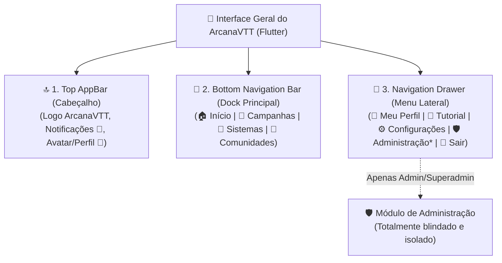
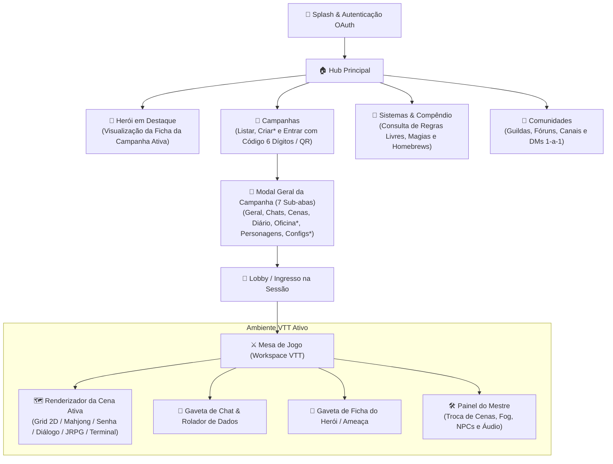

# ArcanaVTT — Módulo 13: Arquitetura FrontEnd Flutter, Mapa de Telas & Metas de Engenharia

---

## 📱 6. Arquitetura e Organização do FrontEnd Mobile (Flutter UI)

A interface do aplicativo Flutter é projetada para **ergonomia mobile**, **alta fluidez (60 FPS)** e distribuição intuitiva dos **botões macro** de navegação.

---

## 📱 11. Mapa de Telas no Aplicativo Flutter

> [!IMPORTANT]
> **Regra Rígida de Personagens:** Personagens **NUNCA são criados de forma avulsa fora de uma mesa**. Toda ficha de personagem é forjada e vinculada obrigatoriamente a uma campanha específica após a aprovação da candidatura pelo Mestre. O Hub oferece apenas visualização rápida do último herói ativo e atalho para sua mesa correspondente.

---

## 🎯 12. Metas de Engenharia & Qualidade

1. **Desempenho 60 FPS:** Otimização máxima no Flutter utilizando `CustomPainter`, widgets com construtores `const` e descarte de renders fora da viewport (*Viewport Culling*).
2. **Resiliência de Rede:** Reconexão automática em segundo plano sem perda do estado do jogo caso a rede móvel oscile.
3. **Clean Architecture em 4 Camadas:** Separação estrita em:
   - `presentation/` (Telas e componentes puros);
   - `controllers/` (Gerência de estado e eventos de tela);
   - `domain/` (Entidades e Casos de Uso puros, 1 caso por arquivo);
   - `data/` (Repositórios, abstrações de cache local e APIs Cloudflare/P2P).
4. **Segurança Zero-Trust:** O cliente mobile nunca dita o resultado de um evento crítico; todas as transições de cena, ganho de itens, dano e final de turnos são validadas na borda (Cloudflare Worker autoritativo).
