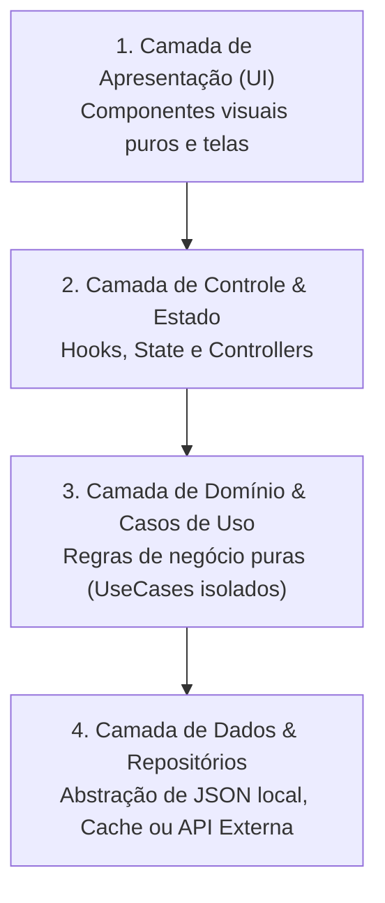

# Diretrizes Oficiais de Arquitetura de Software (Clean Architecture & Segurança)

Este documento estabelece as diretrizes mandatórias de arquitetura, estruturação em camadas limpas, segurança *Zero-Trust*, responsabilidade única estrita e estratégias de eficiência com mitigação inteligente de servidor para todo o ecossistema.

---

## 🏛️ 1. Pilares Fundamentais de Arquitetura

1. **Responsabilidade Única Estrita (Zero Monólitos):**
   - É estritamente proibido criar arquivos genéricos "faz-tudo" (ex: `utils.ts`, `helpers.ts` gigantes ou `manager.ts` com múltiplas funções desconexas).
   - Cada arquivo deve conter **uma única entidade, um único componente, um único caso de uso ou uma única função de utilidade altamente especializada**.
2. **Arquitetura Limpa e Desacoplada (Clean Architecture):**
   - As regras de negócio e casos de uso residem no centro do sistema, 100% isolados de detalhes de interface visual, banco de dados ou bibliotecas externas.
3. **Segurança Zero-Trust (Cliente Não-Confiável):**
   - O servidor mínimo **NUNCA confia cegamente no cliente**. Qualquer dado recebido da interface passa por validação e sanitização estrita de schema antes do processamento.
4. **Mitigação Inteligente de Servidor (*Smart Client Offloading*):**
   - Delegar ao dispositivo do usuário todo o processamento seguro (renderizações gráficas, cálculos de UI, animações, manipulação de estado local e cache offline), reservando o servidor apenas para autenticação, integridade de regras críticas e sincronização multi-usuário.

---

## 🧱 2. Estrutura Oficial em 4 Camadas Limpas

Toda aplicação (Web, Mobile Flutter ou Desktop) deve ser organizada nas seguintes 4 camadas desacopladas:

### 🎨 Camada 1: Apresentação (UI / Components)

- **Responsabilidade:** Renderização visual e recepção de eventos do usuário (*Dumb Components*).
- **Regra Estrita:** Não contém lógica de negócio complexa nem realiza chamadas diretas a APIs de rede ou banco de dados. Apenas recebe dados via props/parâmetros e emite eventos.

### 🎛️ Camada 2: Controle & Estado (Controllers / Hooks / State)

- **Responsabilidade:** Gerenciar o ciclo de vida da tela, orquestrar múltiplos casos de uso e atualizar o estado da interface.
- **Regra Estrita:** Atua apenas como ponte entre a UI e a Camada de Domínio.

### 🧠 Camada 3: Domínio & Casos de Uso (Domain / Use Cases)

- **Responsabilidade:** Executar a lógica de negócio pura da aplicação.
- **Regra Estrita:**
  - **1 Caso de Uso por Arquivo:** Cada ação do sistema é uma classe ou função única (ex: `calcular-total-carrinho.usecase.ts`, `validar-ficha-personagem.usecase.dart`).
  - Totalmente agnóstica de framework (não importa React, Flutter UI ou Node.js).

### 🗄️ Camada 4: Dados & Repositórios (Data / Repositories)

- **Responsabilidade:** Abstração de persistência e comunicação externa através de interfaces (*Repository Pattern*).
- **Regra Estrita:** A camada de domínio chama `IUserRepository`; a implementação concreta (`JSONUserRepository`, `CloudflareD1UserRepository` ou `IndexedDBUserRepository`) decide onde os dados são gravados sem alterar o resto do sistema.

---

## 🛡️ 3. Mitigação Inteligente de Servidor com Salvaguarda de Segurança

A redução de carga de servidor deve ser feita com rigoroso cuidado para evitar brechas de segurança:

| Tipo de Processamento | Onde Deve Executar | Diretriz de Segurança & Eficiência |
| :--- | :--- | :--- |
| **Renderização, UI & Animações** | **100% no Dispositivo (Cliente)** | Economiza banda e CPU do servidor; garante resposta instantânea ao usuário. |
| **Armazenamento de Estado Pessoal** | **Dispositivo do Usuário (`.json`/Cache)** | Armazena dados locais para uso offline sem custo de banco em nuvem. |
| **Pré-Validação de Formulários** | **Cliente (Otimista)** | Melhora a UX do usuário com feedback instantâneo. |
| **Validação de Regras Críticas** | **Servidor Mínimo (Árbitro Autoritativo)** | Validação obrigatória de regras de negócio, dados de segurança e anti-fraude. |
| **Autenticação & Controle de Acesso** | **Servidor / Edge / BaaS** | Gestão segura de tokens, hashes de senha e permissões de perfil. |

> [!CAUTION]
> Nunca delegue para o cliente regras de negócio que envolvam transações financeiras, concessão de privilégios de segurança ou controle crítico de inventário/pontuação em ambientes competitivos sem validação autoritativa no servidor.

---

## ⚡ 4. Padrão de Backend Mínimo & Serverless Edge

Para APIs e serviços externos:

1. **APIs 100% Stateless (Sem Estado):** Os endpoints (ex: Cloudflare Workers) não devem reter estado em memória de servidor. Toda requisição é autenticada e autossuficiente.
2. **Fail-Fast na Entrada:** Payloads com formato inválido são rejeitados na primeira linha do handler (via schemas como *Zod*), evitando consumo desnecessário de CPU ou consultas a banco.
3. **Zero Processamento Ocioso:** Nenhum servidor deve ficar rodando tarefas contínuas desnecessárias se puderem ser acionadas por eventos sob demanda (*Event-Driven*).
