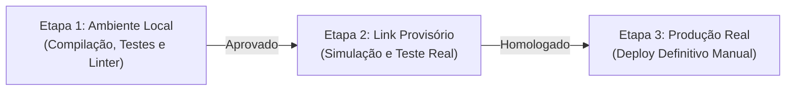

# Procedimento Oficial de Deploy Manual & Publicação (3 Etapas)

Este guia define o protocolo rigoroso de deploy manual via linha de comando para todas as plataformas suportadas. O processo é deliberado, desacoplado de commits automáticos do GitHub e estruturado em 3 etapas de validação obrigatórias.

---

## 🚦 O Protocolo das 3 Etapas Manuais



---

## 🛠️ Etapa 1: Validação e Compilação no Ambiente Local

Antes de gerar qualquer artefato de deploy, execute os comandos de validação na raiz do projeto:

### 1.1. Análise Estática & Verificação de Tipos
```bash
# Para projetos TypeScript / Next.js:
npm run lint
npx tsc --noEmit

# Para projetos Flutter / Dart:
flutter analyze
dart analyze

# Para projetos Python:
flake8 . # ou ruff check .
```

### 1.2. Sanitização Obrigatória de Código
- [ ] **Mocks Removidos:** Todos os dados temporários ou estáticos de teste foram excluídos.
- [ ] **Logs de Debug Removidos:** Proibido manter `console.log`, `print` ou debuggers soltos.
- [ ] **Proteção de Segredos:** O arquivo `.env` está no `.gitignore` e nenhuma chave privada está no código.
- [ ] **Otimização de Assets:** Ícones em `.svg` devidamente otimizados (SVGOMG) e mídias pesadas referenciadas por links externos (Google Drive/CDN).

> [!CAUTION]
> **Critério de Bloqueio 1:** Se houver qualquer erro de compilação ou linter, o deploy é **interrompido imediatamente**.

---

## 🌐 Etapa 2: Deploy para Link Provisório (Simulação em Produção)

Gere a build e publique manualmente em um ambiente de preview/staging para testar o comportamento em rede real:

### ⚡ 2.1. Cloudflare Pages (Preview Manual)
```bash
# 1. Compilar o projeto
npm run build

# 2. Publicar em preview temporário
npx wrangler pages deploy dist --branch=preview
```

### 🚀 2.2. Vercel (Preview Manual)
```bash
# Executa deploy gerando URL temporária de teste:
vercel
```

### 📱 2.3. Flutter (Compilação de APK & Teste no BlueStacks)
```bash
# 1. Gerar o arquivo APK limpo de release
flutter build apk --release

# 2. Localizar o APK gerado em:
# build/app/outputs/flutter-apk/app-release.apk

# 3. Teste Manual: Instalar e testar o APK diretamente no emulador BlueStacks no PC.
```

### 🐳 2.4. Koyeb & Render (Ambiente de Staging)
```bash
# Disparar deploy manual na branch de teste/staging pelo terminal CLI:
koyeb service redeploy <service-name>
```

> [!CAUTION]
> **Critério de Bloqueio 2:** É **estritamente proibido** avançar para a Etapa 3 sem que o desenvolvedor tenha navegado no link provisório (ou testado o APK no BlueStacks) e confirmado que todas as rotas, APIs e fluxos funcionam sem erros.

---

## 🏆 Etapa 3: Deploy Definitivo para Produção Real

Após a homologação plena no link provisório:

### 3.1. Cloudflare Workers / Pages (Produção)
```bash
# Para Cloudflare Workers (APIs Serverless):
npx wrangler deploy

# Para Cloudflare Pages (Frontends):
npx wrangler pages deploy dist --branch=main
```

### 3.2. Vercel (Produção)
```bash
# Publicação definitiva com domínio principal:
vercel --prod
```

### 3.3. GitHub Pages (Produção)
```bash
# Build e publicação manual
npm run build
npx gh-pages -d dist # ou script de deploy estático
```

---

## 📜 4. Ações Finais Pós-Deploy

Após a confirmação de que a produção está 100% operacional:
1. **Criar a Tag SemVer no Git:** `git tag vX.Y.Z` e `git push origin vX.Y.Z`.
2. **Atualizar o `CHANGELOG.md`:** Registrar formalmente a versão publicada.
3. **Monitoramento Inicial:** Abrir o console do navegador e logs do servidor para verificar as primeiras requisições reais.

