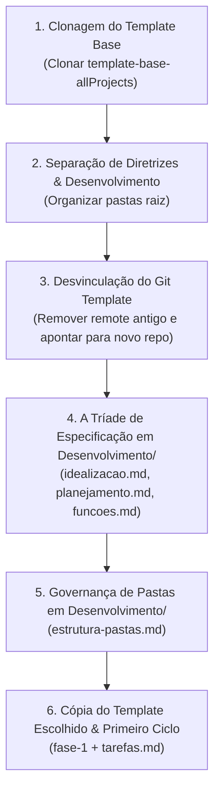

# Procedimento Oficial de Setup & Inicialização de Projetos

Este guia orienta o desenvolvedor e o assistente de IA na criação e inicialização formal de qualquer novo projeto no nosso ecossistema. 

> [!IMPORTANT]
> **Princípio Fundamental: Qualidade sobre Velocidade.**  
> É estritamente proibido pular etapas de documentação, apressar decisões arquiteturais ou escrever código antes que a Tríade de Especificação e a Governança de Pastas estejam 100% claras e aprovadas.

---

## 📂 1. Estrutura Padrão de Espaço de Trabalho do Projeto

Todo novo projeto é estruturado na raiz com duas pastas principais:

```text
meu-novo-projeto/
├── Diretrizes/                      # Repositório de blueprints e regras base (Guia Consultivo)
│   ├── .agents/                    # Regras e skills ativas para IA
│   ├── docs/                       # Manuais de fluxo, stacks, infra e ferramentas
│   ├── templates/                  # Boilerplates de referência
│   ├── GEMINI.md                   # Diretrizes para assistentes de IA
│   └── README.md                   # Apresentação das diretrizes
└── Desenvolvimento/                 # ARQUIVOS OFICIAIS DO PROJETO EM DESENVOLVIMENTO
    ├── idealizacao.md              # Tríade: Conceito & GDD
    ├── planejamento.md             # Tríade: Faseamento
    ├── funcoes.md                  # Tríade: Especificação Técnica
    ├── estrutura-pastas.md         # Governança de Arquitetura Viva
    ├── tarefas.md                  # Tarefas do ciclo ativo
    └── (código-fonte do app)       # Código, componentes, assets e testes
```

---

## 📋 2. Fluxo Sequencial de Setup (Passo a Passo)



---

## 🌿 3. Inicialização e Desvinculação do Git

Ao iniciar um novo projeto a partir da clonagem do template:

1. **Desvincular do Repositório de Templates no GitHub:**
   ```bash
   # Remover o remote original do template base
   git remote remove origin

   # Conectar ao novo repositório dedicado criado no GitHub para este projeto:
   git remote add origin https://github.com/usuario/novo-repositorio-do-projeto.git
   ```

2. **Garantir a Branch `main` Oficial:**
   ```bash
   git branch -M main
   ```

---

## 📝 4. Criação da Tríade de Especificação (em `Desenvolvimento/`)

Dentro da pasta [`Desenvolvimento/`](file:///c:/Users/João/Documents/Programas/Flutter/ArcanaVTT/Desenvolvimento), crie os 3 documentos obrigatórios antes de qualquer código:

1. **`Desenvolvimento/idealizacao.md` (Conceito & GDD):**
   - Resumo narrativo da ideia, propósito, visão de telas e público-alvo.
2. **`Desenvolvimento/planejamento.md` (Faseamento Estruturado):**
   - Divisão em Fases rígidas e subfases, com parágrafo explicativo ao final.
3. **`Desenvolvimento/funcoes.md` (Especificação Técnica Detalhada):**
   - Detalhamento de cada função, APIs, tipo de persistência (`.json` local / D1 / Supabase) e stack escolhida.

---

## 🏗️ 5. Governança de Arquitetura (`Desenvolvimento/estrutura-pastas.md`)

Crie o arquivo de governança restritiva dentro de `Desenvolvimento/`:

- **`Desenvolvimento/estrutura-pastas.md`:**
  - Define a finalidade exata de cada pasta dentro de `Desenvolvimento/`.
  - A IA e o desenvolvedor devem consultar este documento antes de criar qualquer novo arquivo.

---

## 🚀 6. Cópia do Template & Início da Fase 1

1. **Copiar o Boilerplate Selecionado:**
   - Copie o conteúdo do template apropriado de `Diretrizes/templates/` para `Desenvolvimento/`.
2. **Abrir a Branch da Fase 1:**
   ```bash
   git checkout -b fase-1
   ```
3. **Criar `Desenvolvimento/tarefas.md`:**
   - Detalhando as tarefas que serão construídas no Ciclo/Subfase 1.
4. **Instalação & Auditoria de Linter:**
   - Instalar dependências e validar se a compilação roda limpa com zero erros.

