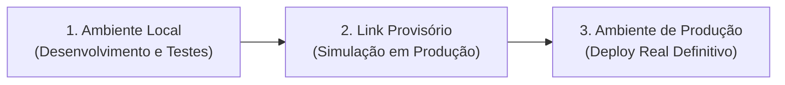

# Guia de Hospedagem & Infraestrutura

Este documento é a referência oficial para tomada de decisão, arquitetura de infraestrutura, armazenamento e estratégias de deploy do nosso ecossistema de projetos.

---

## 🎯 1. Princípios Cardeais de Infraestrutura

1. **Custo Zero & Máxima Leveza:** Prioridade absoluta para camadas gratuitas (*Free Tier*) generosas e arquiteturas leves sem custos fixos desnecessários.
2. **Coesão de Ecossistema:** Sempre que um projeto adotar um provedor central, priorize expandir os recursos adicionais dentro do mesmo ecossistema (ex: se o backend está no *Cloudflare Workers*, utilize *Cloudflare D1, R2 e KV*; se estiver no *Supabase*, utilize *PostgreSQL, Auth e Storage* integrados).
3. **Decisão Contextual e Holística:** A escolha da plataforma avalia os objetivos do projeto, requisitos funcionais, público/dispositivo alvo, complexidade, volume de dados e a stack técnica definida.
4. **Deploy Manual e Controlado:** O processo de publicação para produção deve ser deliberado, disparado manualmente pelo desenvolvedor e desacoplado de commits automáticos no GitHub.

---

## 🌐 2. Catálogo Oficial de Plataformas e Provedores

### ⚡ 2.1. Cloudflare (Pages, Workers, D1, R2, KV)
- **Melhor para:** Frontends estáticos/SPAs ultra-rápidos, PWAs, APIs serverless em Edge, microserviços e bancos SQL serverless.
- **Serviços Integrados:**
  - **Cloudflare Pages:** Hospedagem de frontends estáticos e aplicações compiladas.
  - **Cloudflare Workers:** APIs serverless com execução distribuída global de latência mínima.
  - **Cloudflare D1:** Banco de dados relacional SQL serverless (baseado em SQLite) na Edge.
  - **Cloudflare R2:** Armazenamento de objetos/arquivos sem taxas de transferência de saída (*egress free*).
  - **Cloudflare KV:** Armazenamento de chave-valor de altíssima velocidade para leitura.
- **Vantagens:** Proteção DDoS líder de mercado, latência global quase nula e plano gratuito amplo.

---

### 🚀 2.2. Vercel
- **Melhor para:** Aplicações Web SSR/SSG desenvolvidas em Next.js e ecossistemas React complexos.
- **Vantagens:** Otimização nativa para Next.js, renderização híbrida rápida e geração de links de preview para validação.

---

### 📄 2.3. GitHub Pages
- **Melhor para:** Documentações públicas, landing pages puramente estáticas e projetos abertos de baixa complexidade.
- **Vantagens:** Totalmente gratuito, integrado nativamente ao repositório para páginas estáticas (HTML/CSS/JS).

---

### 🐳 2.4. Koyeb & Render (PaaS / Containers)
- **Melhor para:** Servidores que demandam execução contínua (processos persistentes), APIs em Node.js/Python, servidores WebSockets para multiplayer/chat e bots.
- **Vantagens:**
  - **Koyeb:** Deploy simplificado com excelente performance global e suporte nativo a containers Docker e microVMs.
  - **Render:** Suporte prático a web services, cron jobs e workers de fundo com boa camada gratuita.

---

### 🗄️ 2.5. Supabase & Firebase (BaaS - Backend as a Service)
- **Melhor para:** Aplicações completas que necessitam de autenticação pronta, banco de dados gerenciado em nuvem e eventos em tempo real.
- **Divisão de Uso:**
  - **Supabase:** Ideal para sistemas relacionais com **PostgreSQL**, controle de acesso refinado (RLS) e APIs REST/GraphQL automáticas.
  - **Firebase:** Ideal para ecossistemas rápidos com **Firestore/Realtime Database**, autenticação simples e sincronização em tempo real.

---

### 📁 2.6. Google Drive (Hospedagem de Ativos Pesados Imutáveis)
- **Melhor para:** Armazenamento externo de arquivos pesados que **não sofrem alterações frequentes** (músicas/efeitos sonoros `.mp3`, vídeos, imagens pesadas `.png`/`.webp` e pacotes estáticos).
- **Diretriz de Uso:** Referenciamento direto via links públicos/IDs para evitar sobrecarga no repositório de código e manter a hospedagem principal leve e gratuita.

---

## 🗄️ 3. Estratégia de Banco de Dados & Persistência

| Tipo de Aplicação | Solução Padrão | Justificativa |
| :--- | :--- | :--- |
| **Local / Offline / Uso Pessoal** | Arquivos **`.json`** locais | Simplicidade total, zero configuração de servidor, portabilidade e máxima leveza. |
| **Híbrida (Local + Nuvem)** | **`.json` local** com sincronização via API/Cloud | O dispositivo mantém o estado rápido em JSON e sincroniza pontualmente com o serviço externo. |
| **Serverless / Edge** | **Cloudflare D1** | SQL nativo ultra-rápido integrado aos Workers com custo zero. |
| **BaaS / Relacional Completo** | **Supabase (PostgreSQL)** | Poder relacional, autenticação segura e APIs geradas automaticamente. |
| **BaaS NoSQL / Realtime** | **Firebase Firestore** | Facilidade de sincronização em tempo real multi-dispositivo. |

> [!NOTE]
> Bancos de dados relacionais pesados ou alternativas como SQLite local só devem ser adotados em raras exceções formalmente justificadas no `funcoes.md` do projeto.

---

## 📦 4. Gestão de Mídias, Áudios & Arquivos Pesados

1. **Aplicações 100% Online:**
   - Mídias estáticas e imutáveis devem ser hospedadas externamente (Google Drive, CDNs ou Cloudflare R2) e consumidas via **links externos**.
   - Ícones e gráficos visuais de interface utilizam arquivos vetoriais **`.svg`** embarcados.
2. **Aplicações Locais ou Híbridas:**
   - Mídias essenciais são armazenadas no próprio aparelho do usuário ou puxadas sob demanda com cache local.
3. **Uploads de Usuários:**
   - Seguem a regra de coesão: se o projeto usa Cloudflare, usa-se *R2*; se usa Supabase, usa-se *Supabase Storage*; se usa Firebase, usa-se *Firebase Storage*.

---

## 🚀 5. Fluxo de Ambientes & Procedimento de Deploy

Para garantir estabilidade sem complexidade excessiva de automações desnecessárias, os deploys seguem rigorosamente um **fluxo em 3 etapas manuais**:

### 📋 As 3 Etapas de Validação:

1. **Etapa 1 — Ambiente Local:**
   - Desenvolvimento, validações de linter, execução dos testes do módulo e verificação funcional na máquina do desenvolvedor.
2. **Etapa 2 — Links Provisórios (Teste em Ambiente Real):**
   - Publicação manual em URLs temporárias de preview/staging fornecidas pela plataforma (ex: *Cloudflare Pages Preview, Vercel Preview, deploy de teste no Koyeb*).
   - Teste prático do comportamento da aplicação em ambiente de rede real, validação de rotas, responsividade e chamadas de API.
3. **Etapa 3 — Produção Real:**
   - Com 100% das funcionalidades validadas nos links provisórios e os dados mockados totalmente sanitizados, o deploy para produção é disparado manualmente via CLI ou painel da plataforma.

---

## 🔒 6. Gestão de Domínios, DNS & Segurança

- **DNS & Domínios:** Definidos conforme a conveniência e stack do projeto, priorizando provedores que ofereçam SSL automático e proteção DDoS.
- **Variáveis de Ambiente:** Chaves de API e segredos nunca são incluídos no código-fonte e devem ser configurados manualmente no painel de controle do serviço de hospedagem alvo antes do deploy final.

