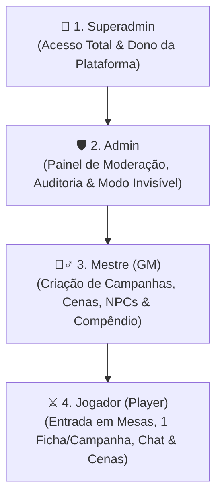
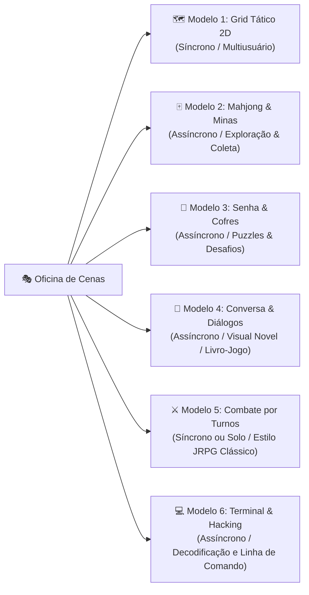
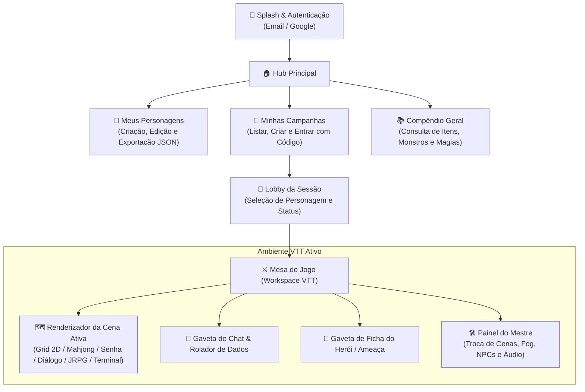

# ArcanaVTT — Documento de Idealização & GDD (Game Design Document)

---

## 📖 1. Visão Geral & Propósito do Projeto

O **ArcanaVTT** é uma plataforma inovadora de mesa virtual de RPG (*Virtual Tabletop - VTT*) desenvolvida nativamente em **Flutter (com foco primordial em Android)**, apoiada por um backend serverless leve e banco de dados externo em nuvem (**Cloudflare Workers + Cloudflare D1 / WebSockets**).

Evolução direta do ecossistema concebido no *0PesadeloWebVTT / RetroForge VTT*, o ArcanaVTT transporta a flexibilidade de um VTT completo e a construção visual (*No-Code*) para a palma da mão de mestres e jogadores, proporcionando sessões ágeis, imersivas e sem atrito.

### 🌟 Pilares Fundamentais:
1. **Construção Visual No-Code:** O mestre cria mundos, mapas, quebra-cabeças, árvores de diálogo e regras visuais sem precisar escrever uma única linha de código.
2. **Execução Híbrida & Mitigação Inteligente (*Client-Side First*):** O aplicativo móvel Flutter renderiza e calcula todo o estado visual, interfaces, efeitos sonoros e IA básica de NPCs localmente, enquanto o servidor mínimo na borda (Cloudflare) atua como árbitro autoritativo apenas para validar turnos, ações críticas e sincronizar o estado entre jogadores conectados.
3. **Custo Operacional Zero:** Arquitetura 100% projetada para operar dentro dos planos gratuitos (*Free Tier*) de alta performance da Cloudflare (Workers, D1, KV e WebSockets).
4. **Experiência Mobile-First:** Ergonomia otimizada para toque na tela do celular, interface com suporte a gestos a 60 FPS, consumo mínimo de bateria e dados móveis.

---

## 👥 2. Hierarquia de Cargos, Níveis de Administração & Permissões

O ArcanaVTT implementa um modelo rigoroso de controle de acesso baseado em papéis (*RBAC - Role-Based Access Control*), garantindo governança, moderação e segurança para todos os usuários da plataforma.

---

### ⚔️ 2.1. Cargo: Jogador (Player)
*Todos os novos usuários cadastrados no sistema iniciam automaticamente neste cargo (exceto o Superadmin).*

- **Ingresso em Mesas:** Pode pesquisar campanhas públicas por filtros ou solicitar entrada em campanhas através do código alfanumérico / link de convite.
- **Perfil Pessoal:** Pode editar e personalizar livremente seu perfil de usuário (nome de exibição, avatar, tema visual, preferências de áudio e acessibilidade).
- **Vínculo de Personagem:** Pode criar e vincular **1 personagem-jogador (ficha)** por campanha da qual participa.
- **Interação em Cenas:** Pode ingressar na cena ativa da mesa e interagir com os elementos e modelos de cena de acordo com as regras estabelecidas pelo Mestre (mover seu próprio token no Grid, resolver puzzles de Senha, minerar no Mahjong, responder diálogos, lutar no combate por turnos).
- **Comunicação:** Pode participar dos chats das campanhas em que estiver inserido (mensagens públicas no canal Geral, sussurros autorizados e visualização do log de combate).
- **Rolagens & Ficha:** Pode realizar testes de perícia, ataques, gerenciar seus pontos vitais e interagir com sua própria ficha de personagem.
- **Autonomia de Participação:** Pode sair de campanhas a qualquer momento por vontade própria.
- **Consulta de Conteúdo:** Pode visualizar e pesquisar sistemas de RPG, tabelas públicas e campanhas abertas com uso de filtros.
- *(Funções adicionais menores e complementares serão incorporadas nas fases subsequentes).*

---

### 🧙‍♂️ 2.2. Cargo: Mestre (Game Master - GM)
*Cargo atribuído manualmente por um Superadmin ou Admin, ou adquirido de forma automatizada através de planos/pagamento.*

- **Poderes de Jogador:** Possui todas as funcionalidades e acessos do cargo de Jogador.
- **Criação de Campanhas:** Pode criar, configurar e gerenciar suas próprias campanhas (definir regras, privacidade, limites e imagens de capa).
- **Oficina de Cenas:** Pode criar, editar, duplicar, ordenar e transicionar entre qualquer um dos 6 modelos de cena (Grid Tático, Mahjong, Senhas, Diálogos, JRPG e Terminal).
- **Customização de Compêndio:** Pode estender e editar o compêndio do sistema de RPG escolhido na campanha, criando conteúdos *Homebrew*.
- **Criação de Elementos com Limites Rígidos:** Pode criar NPCs, Ameaças, Monstros, Itens, Armas, Rituais e Pistas para suas campanhas, respeitando limites rígidos de armazenamento por categoria (para manter a leveza do banco e estabilidade da sessão).
- **Controle de Mesa:** Controla a iluminação, Neblina de Guerra (*Fog of War*), trilhas sonoras/efeitos de áudio, aprovação de descansos, iniciativa e distribuição de XP.
- **🛡️ Regra de Contexto de Campanha (Rebaixamento Local):** Caso um usuário com cargo de Mestre entre em uma campanha criada por **outro Mestre**, ele é automaticamente tratado como **Jogador** dentro daquele contexto, sem acesso aos segredos ou painéis de mestre daquela mesa específica.

---

### 🛡️ 2.3. Cargo: Administrador (Admin)
*Cargo de alta confiança, outorgado **EXCLUSIVAMENTE pelo Superadmin**.*

- **Herança Total de Funções:** Possui todas as capacidades e ferramentas dos Jogadores e dos Mestres.
- **Acesso ao Painel Administrativo:** Painel restrito e seguro para governança global da plataforma:
  - **Visão Global:** Consulta e auditoria de todas as campanhas ativas, sistemas cadastrados, perfis de usuários, fichas criadas e compêndios homebrew.
  - **Segurança & Alertas:** Acompanhamento de relatórios de segurança, detecção de tráfego suspeito, logs de erro e lista de usuários bloqueados/banidos.
  - **Modo Observador Invisível (*Ghost Spectator*):** Pode entrar em qualquer campanha ao vivo em modo 100% invisível para os participantes, permitindo fiscalizar a sessão em tempo real sem permissão de enviar mensagens no chat ou interagir com o mapa, garantindo zero interferência no jogo.
  - **Moderação de Conteúdo:** Pode alterar configurações de visibilidade de campanhas e sistemas, despublicar conteúdos impróprios ou excluir materiais que violem as diretrizes.
  - **Punição & Banimento:** Pode aplicar suspensões temporárias, bloqueios de conta ou banimento permanente de usuários do sistema como um todo.

---

### 👑 2.4. Cargo: Superadmin (Dono da Plataforma)
*Papel único, exclusivo e absoluto, reservado ao criador/proprietário do sistema.*

- **Autoridade Suprema:** Acesso irrestrito e incondicional a 100% das rotas, bancos de dados, painéis e configurações do sistema.
- **Gestão de Administradores:** É o único papel capaz de conceder ou revogar o cargo de **Admin** para outros usuários.
- **Controle Estrutural:** Acesso direto às configurações de infraestrutura, migrações de banco D1, faturamento/planos e políticas globais da plataforma.

---

## 🏛️ 3. Arquitetura Modular de Elementos (Compêndio vs Instâncias)

Para garantir reutilização máxima de dados e baixo consumo de memória:

1. **Compêndio Base (Dados Frios / Reutilizáveis):**
   - Catálogo universal com templates de NPCs, Ameaças, Armas, Itens, Perícias, Habilidades/Magias e Estruturas.
   - Cada elemento possui um ID base único e imutável armazenado no banco/KV.
2. **Instâncias de Cena (Dados Quentes / Estado Dinâmico):**
   - Quando um elemento do compêndio é inserido em um mapa ou cena, o sistema instancia uma cópia leve com estado próprio (HP atual, posição X/Y no grid, condições aplicadas, inventário dinâmico).
3. **Persistência Seletiva:**
   - Apenas alterações significativas e eventos críticos (dano sofrido, itens adquiridos, conclusão de cenas, aprovação de XP) são persistidos no backend.

---

## 🎭 4. Os 6 Modelos de Cenas Interativas

O diferencial basilar do ArcanaVTT é sua capacidade de alternar dinamicamente entre múltiplos formatos de experiência interativa durante a sessão:

### 🗺️ Modelo 1: Grid Tático 2D (Combate Posicional & Exploração)
- **Natureza:** Síncrono (múltiplos usuários simultâneos).
- **Estrutura:** Matriz 2D configurável (largura x altura até 500 células) convertida em array no backend e renderizada via Flutter Canvas de alta performance.
- **Sistema de 3 Camadas (Layers):**
  - *Layer 1 (Chão/Fundo):* Entidades e jogadores passam livremente por cima (pisos, grama, água rasa, tapetes).
  - *Layer 2 (Obstáculos/Colisão):* Mesmo nível das entidades, bloqueando passagem e sobreposição (paredes, rochas, portas fechadas, outros tokens).
  - *Layer 3 (Sobreposição/Teto):* Entidades passam por baixo do elemento visual (copas de árvores, telhados, pontes elevadas).
- **Estética & Vetores:** Fundo personalizável com linhas de grid configuráveis (preto, dourado ou invisível). Ícones e estruturas em formato **SVG vetorial transparente** com customização dinâmica de cores das linhas pelo Mestre.
- **Neblina de Guerra (*Fog of War*):** Ocultação dinâmica com ferramenta de revelação manual ou visão baseada no raio do token.
- **Gatilhos de Célula:** Eventos programáveis (ex: pisar no tile X dispara uma armadilha, abre uma passagem no Layer 2 ou teleporta o jogador para outra cena).

### 🀄 Modelo 2: Mahjong, Memória & Campo Minado (Mineração & Puzzles)
- **Natureza:** Assíncrono (1 jogador por vez).
- **Mecânica:** Combina memória, Mahjong e risco de Campo Minado:
  - Inicialmente, todos os blocos estão visíveis. Ao formar o primeiro par válido, todas as peças se ocultam sob o símbolo de interrogação `?`.
  - Cada símbolo está associado a um número secreto sorteado na abertura da cena.
  - **Bombas (Peças Roxas/Lilás):** Causam dano direto à vida (HP) do personagem ao serem ativadas.
  - Formar pares remove as peças e acumula pontos. Ao limpar o tabuleiro sem morrer, o jogador avança de nível.
  - O Mestre configura recompensas por pontuação atingida (ouro, itens, minérios) e consequências em caso de morte.

### 🔐 Modelo 3: Senha & Mecânica de Cofre (Desafio Lógico)
- **Natureza:** Assíncrono (1 jogador por vez).
- **Mecânica:** O Mestre define o número de slots e o tipo de elementos aceitos (números, letras ou ícones SVG).
- **Dicas Visuais & Matemáticas:**
  - *Dica Matemática Global:* Cada elemento possui um peso numérico; se o produto da combinação inserida estiver acima da meta, a borda fica vermelha; se abaixo, azul.
  - *Dica Precisa por Slot:* Cada slot indica se o valor selecionado está acima (vermelho), exato (verde) ou abaixo (azul) do caractere correto daquele slot.
- **Consequências:** Erros podem causar dano elétrico/mecânico ao personagem ou bloquear o cofre após X tentativas. Sucessos entregam recompensas ou acionam gatilhos de cena.

### 💬 Modelo 4: Conversa & Árvore de Diálogos (Narrativa Interativa)
- **Natureza:** Assíncrono (1 jogador por vez).
- **Mecânica:** Interface estilo *Visual Novel / Livro-Jogo*. O Mestre cria nós de mensagens com ilustrações/retratos de NPCs (via links leves) e botões de resposta ramificados.
- **Gatilhos de Escolha:** Respostas podem testar perícias da ficha do jogador, entregar itens, mudar o status de alianças da campanha ou transicionar para combate.

### ⚔️ Modelo 5: Combate por Turnos Clássico (Estilo JRPG)
- **Natureza:** Síncrono (com o grupo) ou Solo (contra monstros pré-programados).
- **Mecânica:** Batalha por turnos estilo *Final Fantasy / Pokémon*, consumindo as estatísticas reais da ficha (Vida, Sanidade/Mana, Ações, Habilidades e Itens) contra ameaças do compêndio.
- **Automação de NPCs:** Monstros executam ações pré-definidas (rotinas de IA local validadas pelo backend) sem exigir microgerenciamento constante do Mestre.

### 💻 Modelo 6: Terminal & Hacking Arcano
- **Natureza:** Assíncrono (1 jogador por vez).
- **Mecânica:** Interface de terminal retrô com suporte a alfabetos alternativos (runas arcanas, cifras alienígenas ou comandos hacker).
- **Interação:** O jogador digita comandos e recebe respostas pré-scriptadas baseadas em condicionais (`if/else` configuradas pelo Mestre), desbloqueando dados confidenciais ou desativando defesas da masmorra.

---

## 📜 5. Sistema de Regras, Fichas & Mecânicas (AlphaD6 & Modular)

O ArcanaVTT integra o motor de regras modular com suporte nativo ao sistema **AlphaD6 / D20 Híbrido**:

1. **Atributos & Especializações:**
   - Atributos base associados a dados e perícias especializadas.
   - Rolagens automáticas com cálculo de margens de sucesso, críticos e falhas.
2. **Sistema de Ânima, Relógio & Descansos:**
   - Recursos de energia/sanidade geridos com aprovação do Mestre para descansos curtos e longos.
   - Relógios de progresso (*Progress Clocks*) visuais para contagem regressiva de perigos, rituais e eventos globais.
3. **Economia & Riqueza (Sistema de Pratas/Moedas):**
   - Gestão simplificada de moedas e níveis de riqueza para compra de suprimentos e equipamentos no compêndio.
4. **Diário de Campanha & Registro de Missões:**
   - Linha do tempo oficial da campanha onde eventos relevantes, descobertas e resumos de sessões são registrados de forma permanente.

---

## 🎵 6. Gestão de Áudio & Ambiência

- **Controle pelo Mestre:** Disparo de faixas musicais e efeitos sonoros (*SFX*) vinculados às cenas ou momentos de tensão.
- **Consumo Inteligente:** O aplicativo não carrega arquivos de áudio pesados no repositório; o Mestre referencia links externos (Google Drive, Cloudflare R2 ou URLs diretas) e os clientes reproduzem localmente via streaming com cache temporário.
- **Ajustes Individuais:** Cada jogador possui controle independente de volume para música e efeitos sonoros em seu aparelho.

---

## 📱 7. Mapa de Telas no Aplicativo Flutter

---

## 🎯 8. Metas de Engenharia & Qualidade

1. **Desempenho 60 FPS:** Otimização máxima no Flutter utilizando `CustomPainter`, widgets com construtores `const` e descarte de renders fora da viewport.
2. **Resiliência de Rede:** Reconexão automática em segundo plano sem perda do estado do jogo caso a rede móvel oscile.
3. **Clean Architecture em 4 Camadas:** Separação estrita em `presentation/`, `controllers/`, `domain/` e `data/`.
4. **Segurança Zero-Trust:** O cliente mobile nunca dita o resultado de um evento crítico; todas as transições de cena, ganho de itens e dano são validadas na borda.
