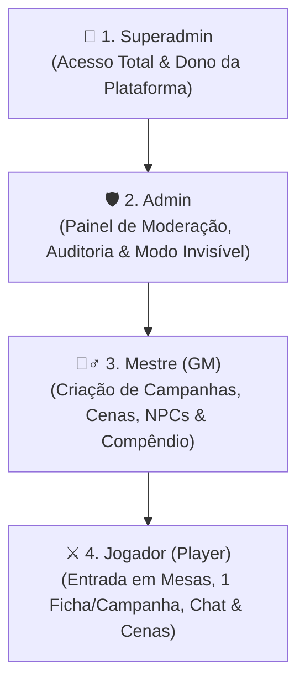
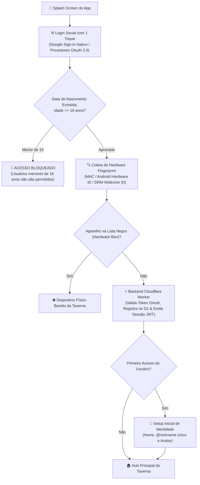
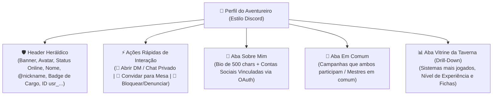
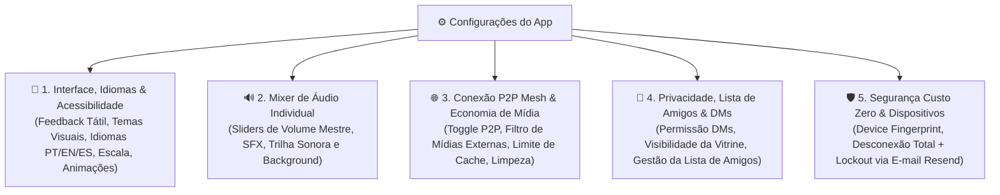
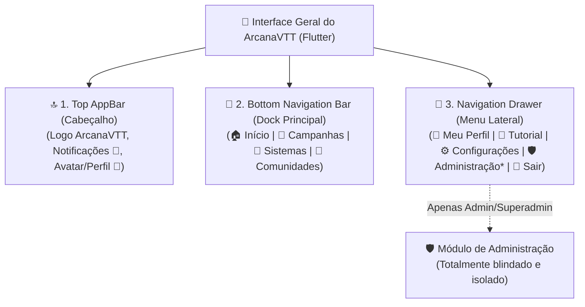
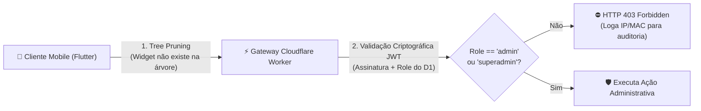
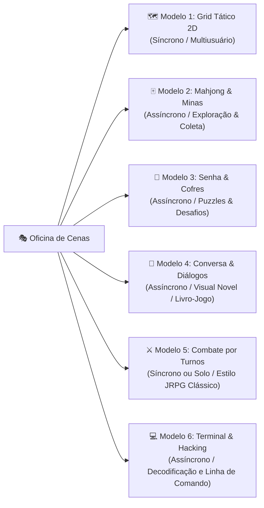
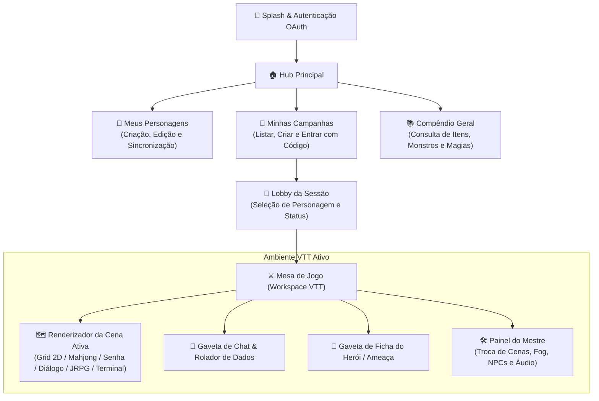

# ArcanaVTT — Documento de Idealização & GDD (Game Design Document)

---

## 📖 1. Visão Geral & Propósito do Projeto

O **ArcanaVTT** é uma plataforma inovadora de mesa virtual de RPG (*Virtual Tabletop - VTT*) desenvolvida nativamente em **Flutter (com foco primordial em Android)**, apoiada por um backend serverless leve e banco de dados externo em nuvem (**Cloudflare Workers + Cloudflare D1 / WebSockets**).

Evolução direta do ecossistema concebido no *0PesadeloWebVTT / RetroForge VTT*, o ArcanaVTT transporta a flexibilidade de um VTT completo e a construção visual (*No-Code*) para a palma da mão de mestres e jogadores, proporcionando sessões ágeis, imersivas e sem atrito.

### 🌟 Pilares Fundamentais

1. **Construção Visual No-Code:** O mestre cria mundos, mapas, quebra-cabeças, árvores de diálogo e regras visuais sem precisar escrever uma única linha de código.
2. **Execução Híbrida & Mitigação Inteligente (*Client-Side First*):** O aplicativo móvel Flutter renderiza e calcula todo o estado visual, interfaces, efeitos sonoros e IA básica de NPCs localmente, enquanto o servidor mínimo na borda (Cloudflare) atua como árbitro autoritativo apenas para validar turnos, ações críticas e sincronizar o estado entre jogadores conectados.
3. **Custo Operacional Zero:** Arquitetura 100% projetada para operar dentro dos planos gratuitos (*Free Tier*) de alta performance da Cloudflare (Workers, D1, KV e WebSockets).
4. **Experiência Mobile-First:** Ergonomia otimizada para toque na tela do celular, interface com suporte a gestos a 60 FPS, consumo mínimo de bateria e dados móveis.

---

## 👥 2. Hierarquia de Cargos, Níveis de Administração & Permissões

O ArcanaVTT implementa um modelo rigoroso de controle de acesso baseado em papéis (*RBAC - Role-Based Access Control*), garantindo governança, moderação e segurança para todos os usuários da plataforma.



---

### ⚔️ 2.1. Cargo: Jogador (Player)

*Todos os novos usuários cadastrados no sistema iniciam automaticamente neste cargo (exceto o Superadmin).*

- **Ingresso em Mesas:** Pode pesquisar campanhas públicas por filtros ou solicitar entrada em campanhas através do código alfanumérico / link de convite.
- **Perfil Pessoal:** Pode editar e personalizar livremente seu perfil de usuário (nome de exibição, avatar, tema visual, preferências de áudio e acessibilidade).
- **Vínculo de Personagem:** Pode criar e vincular **1 personagem-jogador (ficha)** por campanha da qual participa.
- **Interação em Cenas:** Pode ingressar na cena ativa da mesa e interagir com os elementos e modelos de cena de acordo com as regras estabelecidas pelo Mestre (mover seu próprio token no Grid, resolver puzzles de Senha, minerar no Mahjong, responder diálogos, lutar no combate por turnos).
- **Comunicação:** Pode participar dos chats das campanhas em que estiver inserido (mensagens públicas no canal Geral, sussurros autorizados e visualização do log de combate).
- **Rolagens & Ficha:** Pode realizar testes de perícia, ataques, gerenciar seus pontos vitais e interagir com sua própria ficha de personagem.
- **Autonomia de Participação:** Pode sair de campanhas a qualquer momento por vontade própria.
- **Consulta de Conteúdo:** Pode visualizar e pesquisar sistemas de RPG, tabelas públicas e campanhas abertas com uso de filtros.
- *(Funções adicionais menores e complementares serão incorporadas nas fases subsequentes).*

---

### 🧙‍♂️ 2.2. Cargo: Mestre (Game Master - GM)

*Cargo atribuído manualmente por um Superadmin ou Admin, ou adquirido de forma automatizada através de planos/pagamento.*

- **Poderes de Jogador:** Possui todas as funcionalidades e acessos do cargo de Jogador.
- **Criação de Campanhas:** Pode criar, configurar e gerenciar suas próprias campanhas (definir regras, privacidade, limites e imagens de capa).
- **Oficina de Cenas:** Pode criar, editar, duplicar, ordenar e transicionar entre qualquer um dos 6 modelos de cena (Grid Tático, Mahjong, Senhas, Diálogos, JRPG e Terminal).
- **Customização de Compêndio:** Pode estender e editar o compêndio do sistema de RPG escolhido na campanha, criando conteúdos *Homebrew*.
- **Criação de Elementos com Limites Rígidos:** Pode criar NPCs, Ameaças, Monstros, Itens, Armas, Rituais e Pistas para suas campanhas, respeitando limites rígidos de armazenamento por categoria (para manter a leveza do banco e estabilidade da sessão).
- **Controle de Mesa:** Controla a iluminação, Neblina de Guerra (*Fog of War*), trilhas sonoras/efeitos de áudio, aprovação de descansos, iniciativa e distribuição de XP.
- **🛡️ Regra de Contexto de Campanha (Rebaixamento Local):** Caso um usuário com cargo de Mestre entre em uma campanha criada por **outro Mestre**, ele é automaticamente tratado como **Jogador** dentro daquele contexto, sem acesso aos segredos ou painéis de mestre daquela mesa específica.

---

### 🛡️ 2.3. Cargo: Administrador (Admin)

*Cargo de alta confiança, outorgado **EXCLUSIVAMENTE pelo Superadmin**.*

- **Herança Total de Funções:** Possui todas as capacidades e ferramentas dos Jogadores e dos Mestres.
- **Acesso ao Painel Administrativo:** Painel restrito e seguro para governança global da plataforma:
  - **Visão Global:** Consulta e auditoria de todas as campanhas ativas, sistemas cadastrados, perfis de usuários, fichas criadas e compêndios homebrew.
  - **Segurança & Alertas:** Acompanhamento de relatórios de segurança, detecção de tráfego suspeito, logs de erro e lista de usuários bloqueados/banidos.
  - **Modo Observador Invisível (*Ghost Spectator*):** Pode entrar em qualquer campanha ao vivo em modo 100% invisível para os participantes, permitindo fiscalizar a sessão em tempo real sem permissão de enviar mensagens no chat ou interagir com o mapa, garantindo zero interferência no jogo.
  - **Moderação de Conteúdo:** Pode alterar configurações de visibilidade de campanhas e sistemas, despublicar conteúdos impróprios ou excluir materiais que violem as diretrizes.
  - **Punição & Banimento:** Pode aplicar suspensões temporárias, bloqueios de conta ou banimento permanente de usuários do sistema como um todo.

---

### 👑 2.4. Cargo: Superadmin (Dono da Plataforma)

*Papel único, exclusivo e absoluto, reservado ao criador/proprietário do sistema.*

- **Autoridade Suprema:** Acesso irrestrito e incondicional a 100% das rotas, bancos de dados, painéis e configurações do sistema.
- **Auditoria Total de Comunicações:** Possui permissão de visualizar **todas as conversas e chats privados (DMs 1-a-1)** do sistema para fins de auditoria, segurança e resolução de denúncias graves.
- **Gestão de Administradores:** É o único papel capaz de conceder ou revogar o cargo de **Admin** para outros usuários.
- **Controle Estrutural:** Acesso direto às configurações de infraestrutura, migrações de banco D1, faturamento/planos e políticas globais da plataforma.

---

## 🔐 3. Autenticação 100% OAuth 2.0 & Conformidade LGPD

Para garantir máxima segurança, conformidade estrita com a **LGPD (Lei Geral de Proteção de Dados)** e eliminar qualquer risco de custódia ou vazamento de credenciais, o ArcanaVTT adota autenticação **exclusivamente baseada em Provedores de Identidade OAuth 2.0 / OpenID Connect**.



---

### 🔑 3.1. Princípios de Segurança e Privacidade (LGPD-First)

1. **Zero Custódia de Senhas:** O sistema não armazena, transmite nem processa senhas manuais. A autenticação é delegada a provedores de identidade certificados (Google OAuth 2.0 principal, expansível para Discord/Apple).
2. **E-mails Pré-Verificados:** A autenticação OAuth garante na origem que o e-mail pertence ao usuário legítimo, eliminando cadastros falsos e a necessidade de infraestrutura de envio de e-mails de confirmação.
3. **Extração Automática da Data de Nascimento:** A data de nascimento é capturada de forma segura diretamente da conta autenticada para verificação etária.
4. **🚫 Bloqueio Rígido para Menores de 16 Anos:** O backend valida a data de nascimento no momento do login; se o usuário tiver **menos de 16 anos**, o acesso e cadastro são imediatamente bloqueados.

---

### 🛡️ 3.2. Gestão de Sessão, Auto-Login Escalável & Hardware Ban

1. **Auto-Login Progressivo ("Confiar neste Dispositivo"):**
   - **Contas Novas (< 90 dias):** Ao ativar *"Confiar neste dispositivo"* com validação de Captcha, a sessão local no Android permanece ativa por **15 dias**.
   - **Contas Veteranas (≥ 90 dias sem infrações):** O período de confiança do dispositivo é expandido automaticamente para **30 dias**.
   - **Renovação de Sessão:** Ao término do ciclo de 15 ou 30 dias, o app solicita confirmação rápida de segurança com o provedor OAuth para renovar o token.
   - **Armazenamento Criptografado:** Token JWT salvo no *Android Keystore* seguro através de `flutter_secure_storage`.

2. **Device Fingerprint Profundo & Banimento por Hardware:**
   - Coleta de telemetria técnica de baixo nível do aparelho:
     - Endereço MAC de rede / Hardware UUID;
     - *DRM Widevine Device Unique ID* (identificador criptográfico exclusivo do chip Android);
     - Modelo comercial, fabricante e arquitetura (ex: `Samsung SM-S911B - Galaxy S23`);
     - Versão do Android, Nível de API e Build Fingerprint do sistema operacional.
   - **Hardware Ban:** Caso um usuário seja banido permanentemente pelo Admin/Superadmin por infrações graves, o identificador de hardware do aparelho é inserido na lista negra, impedindo que novas contas sejam criadas ou acessadas a partir daquele mesmo dispositivo físico.

---

## 👤 4. Perfil do Usuário, Vitrine Interativa, Contas Vinculadas & Chat Pessoal (Estilo Discord)

A experiência de **Perfil do Usuário e Interação Social** do ArcanaVTT é fortemente inspirada no modelo do **Discord**, combinando identidade heráldica, conexões sociais, métricas de jogo e comunicação direta entre aventureiros.



---

### 🛡️ 4.1. Visualização de Perfil de Outros Usuários (Modal / Bottom Sheet Estilo Discord)

Ao tocar no avatar ou `@nickname` de qualquer usuário (seja no lobby, no chat da campanha ou em buscas), abre-se a **Ficha de Perfil Social**:

1. **Cabeçalho & Identidade Visual:**
   - Banner estilizado e Avatar com indicador de presença (*Online*, *Em Jogo*, *Ausente*).
   - Nome de exibição em destaque e `@nickname` com botão de cópia rápida.
   - Badge Heráldico do Cargo oficial (`[Jogador]`, `[Mestre]`, `[Admin]`, `[Superadmin]`).
   - Data de ingresso na taverna.
2. **Barra de Ações Rápidas de Interação:**
   - 💬 **Botão "Enviar Mensagem Privada (Abrir DM)":** Abre imediatamente o canal de conversa direta 1-a-1 com o usuário.
   - 🤝 **Botão "Convidar para Campanha" (Exclusivo para Mestres):** Permite selecionar uma mesa liderada pelo Mestre e enviar convite com 1 toque.
   - 🚫 **Menu de Opções:** Bloquear usuário (impede mensagens e convites) ou Denunciar por conduta inadequada para a moderação Admin.
3. **Seção "Sobre Mim":**
   - Biografia (até 500 caracteres).
   - Selos verificados de **Contas Vinculadas** (Discord, Twitch, YouTube, Steam, Instagram, X/Twitter, Reddit) com links diretos.
4. **Seção "Em Comum" (*Mutuals*):**
   - Lista de campanhas ativas ou concluídas em que ambos participam juntos.

---

### 💬 4.2. Sistema de Mensagens Diretas (DMs / Chat Pessoal 1-a-1)

O ArcanaVTT inclui uma central de **Mensagens Diretas** no Hub principal:

- **🔒 Isolamento contra Terceiros & Acesso Supremo de Auditoria:**
  - O canal de DM é **estritamente isolado de outros jogadores, mestres de campanhas ou terceiros**: ninguém na comunidade tem visibilidade sobre a conversa.
  - **👑 Acesso do Superadmin:** Como autoridade máxima da plataforma, o **Superadmin** possui permissão de auditoria e leitura em todas as mensagens e DMs para garantir a segurança da plataforma e analisar denúncias de infrações.
  - No nível de banco (Cloudflare D1) e WebSockets, todas as consultas e eventos validam os participantes (`user_a` e `user_b`) ou a autenticação do Superadmin, bloqueando qualquer outro acesso com `403 Forbidden`.
- **Conversas Privadas em Tempo Real:** Comunicação fluida e instantânea entre os dois jogadores, sincronizada via WebSockets com criptografia em trânsito e persistida no Cloudflare D1.
- **Recursos do Chat Direto:**
  - Envio de mensagens de texto, formatação markdown simples e links;
  - Indicador de digitação em tempo real (*"digitando..."*) e confirmação de leitura;
  - 🎲 **Rolador de Dados Privado no Chat:** Possibilidade de rolar dados rápidos no chat privado (ótimo para testes pré-sessão ou conversas secretas);
  - Notificações de novas mensagens no aparelho.
- **Preferências de Recepção de DMs:** Nas *Configurações*, o usuário pode definir de quem aceita receber novas conversas privadas (*Qualquer usuário*, *Apenas membros de mesas em comum* ou *Ninguém / Apenas Amigos*).

---

### 🔗 4.3. Vinculação de Contas Externas (OAuth 2.0)

Em vez de campos manuais, a integração social utiliza autorizações OAuth 2.0 oficiais:

- **Provedores Suportados:** Discord, Twitch, YouTube, Instagram, X (Twitter), Steam e Reddit.
- **Garantia de Autenticidade:** O sistema puxa o identificador oficial verificado diretamente da plataforma conectada, exibindo selos nobres no perfil.

---

### 📊 4.4. Vitrine da Taverna (Métricas de Engajamento com Drill-Down Interativo)

O sistema calcula automaticamente o perfil de jogador do usuário:

1. **Sistemas de RPG Mais Jogados & Preferências:**
   - Ranking dinâmico dos sistemas mais jogados calculado pelo volume de campanhas e sessões.
2. **Nível de Experiência por Sistema:**
   - Classificação automática de proficiência: *Iniciante* (< 3 sessões), *Praticante* (3-10 sessões), *Veterano* (11-30 sessões), *Mestre do Sistema* (30+ sessões).
3. **Contadores Globais:**
   - Total de Campanhas como Jogador / Mestre, Total de Personagens Forjados e Sessões Jogadas.
4. **🔍 Navegação Detalhada (*Drill-Down* ao Clicar):**
   - Ao tocar em qualquer card de métrica, abre-se a lista detalhada com os registros correspondentes (histórico de sessões, fichas criadas ou campanhas daquele sistema).

---

## ⚙️ 5. Aba de Configurações, Acessibilidade, Rede P2P, Privacidade & Gestão de Dispositivos

Aba dedicada à personalização da interface, acessibilidade, mixers de áudio, governança de dados P2P Mesh, idiomas, privacidade social e segurança de sessões da conta no dispositivo móvel.



---

### 📱 5.1. Preferências de Interface, Idiomas & Acessibilidade Visual e Tátil

- **Idioma do Aplicativo (*Language & Region*):**
  - Seletor com 3 opções explícitas de idioma de interface: *Português do Brasil (PT-BR)* [Padrão Nativo], *Inglês (EN-US)* e *Espanhol (ES-ES)*.
- **Feedback Tátil / Vibração (*Haptic Feedback*):**
  - Seletor de intensidade com 4 opções explícitas: *Desativado*, *Suave*, *Médio* ou *Intenso* (para rolagens de dados, acertos críticos e toques no grid tático).
- **Temas Visuais da Taverna:**
  - Seletor de tema visual com 3 opções: *Modo Escuro Heráldico* (padrão), *Modo Alto Contraste para Luz Solar* e *Modo Economia de Bateria OLED* (pretos puros `#000000`).
- **Escala de Texto & Tipografia:**
  - Ajuste deslizante numérico da fonte (de *80% a 150%*) aplicado em tempo real em fichas de personagem, diários de bordo, menus e chats.
- **Redução de Movimentos & Animações:**
  - Toggle (*Ligado / Desligado*) para desativar animações e transições de tela em dispositivos de menor desempenho.

---

### 🔊 5.2. Mixer de Áudio Individual

- **Slider de Volume Mestre:** Controle numérico deslizante de 0% a 100% para o volume geral do aplicativo.
- **Slider de Efeitos Sonoros (SFX):** Controle independente de 0% a 100% para sons de rolagem de dados, ataques no grid tático, bombas no Mahjong e gatilhos sonoros de cenas.
- **Slider de Trilha Sonora / Ambiência:** Controle independente de 0% a 100% para faixas de música de fundo transmitidas pelo Mestre.
- **Silenciar em Segundo Plano:** Toggle (*Ligado / Desligado*) para pausar áudio e efeitos automaticamente ao minimizar o aplicativo.

---

### 🌐 5.3. Conexão P2P Mesh, Filtro de Segurança & Armazenamento Local

- **🖼️ Filtro de Segurança de Mídia Externa (*Safety Media Filter*):**
  - Seletor com 2 opções de exibição de imagens: *Exibir Todas as Imagens da Mesa (Oficiais e URLs Externas)* ou *Exibir Apenas Mídias Oficiais da Taverna* (substitui imagens de links externos inseridas por outros jogadores por ilustrações vetoriais padronizadas SVG para evitar a exibição de conteúdos indesejados).
- **Compartilhamento P2P Mesh:**
  - Toggle (*Ligado / Desligado*) para autorizar o envio e recebimento direto de mídias de cena, vetores SVG e pacotes homebrew entre dispositivos da taverna.
- **Modo de Dados Móveis para P2P & Mídias:**
  - Seletor com 2 opções: *Somente em Redes Wi-Fi* (padrão de economia) ou *Wi-Fi e Redes Móveis (4G/5G)*.
- **Limite de Cache P2P Mesh no Celular:**
  - Seletor com 4 opções de cota máxima de disco: *500 MB*, *1 GB*, *2 GB* ou *Sem Limite*.
- **Limpeza de Cache com 1 Toque:**
  - Botão destacado `[ 🧹 Limpar Cache de Mídias Locais ]` para liberar espaço em disco sem apagar campanhas ou fichas salvas localmente.

---

### 👥 5.4. Privacidade & Módulo de Gestão da Lista de Amigos

- **👥 Módulo Completo da Lista de Amigos do Aventureiro:**
  - *Localização:* Painel social no perfil, atalho na Top Bar e menu em Comunidades.
  - *Adicionar Amigo:* Envio de solicitação por `@nickname` único ou leitura de QR Code do perfil do aventureiro.
  - *Gerenciamento de Solicitações:* Painel com abas *Solicitações Recebidas* e *Solicitações Enviadas* com botões explícitos `[ Aceitar ]` e `[ Recusar ]`.
  - *Lista de Amigos Confirmados:* Exibição da lista de amigos com indicadores de presença (*Online*, *Em Jogo*, *Ausente*), atalho de 1 toque para abrir DM privada e botão `[ Convidar para Campanha ]`.
  - *Ações de Governança:* Opção de `[ Remover Amigo ]` ou `[ Bloquear Usuário ]`.
- **Permissão de Recebimento de Mensagens Diretas (DMs):**
  - Seletor de privacidade com 3 opções: *Qualquer Usuário da Taverna*, *Apenas Membros de Campanhas em Comum* ou *Apenas Amigos*.
- **Privacidade da Vitrine de Métricas:**
  - Seletor de visibilidade das estatísticas do perfil com 3 opções: *Público na Taverna*, *Apenas para Amigos* ou *Privado (Apenas Eu)*.
- **Visibilidade de Presença Social:**
  - Toggle (*Visível na Taverna / Oculto em Modo Offline*).

---

### 🛡️ 5.5. Segurança Custo Zero, Sigilo de E-mail & Lockout de Dispositivos

- **🔒 Sigilo de E-mail Principal (Visibilidade Restrita):**
  - **REGRA DE PRIVACIDADE:** O e-mail privado vinculado ao OAuth (ex: `usuario@gmail.com`) e o carimbo de data/hora do último login **NÃO são exibidos** nas configurações comuns ou perfis públicos.
  - O perfil público do usuário exibe apenas a insígnia `[Google OAuth Verificado]`.
  - **Exclusividade de Auditoria:** O e-mail exato e os dados de telemetria são visíveis **exclusivamente no Painel de Administração para usuários com cargo Admin ou Superadmin**.
- **Dispositivos Conectados (Telemetria do Device Fingerprint):**
  - Lista de todos os celulares e aparelhos com sessão ativa na conta (Modelo do aparelho, versão do Android, data/hora do último acesso e IP aproximado).
- **🚨 Encerramento Total de Sessões & Lockout com Reautenticação por E-mail (Custo Zero):**
  - Ao clicar no botão `[ 🚨 Desconectar de Todos os Aparelhos ]`:
    1. **Desconexão Geral Imediata:** O backend Cloudflare Worker revoga 100% dos tokens JWT de todos os aparelhos conectados, **inclusive o dispositivo atual do usuário que executou a ação**;
    2. **Limpeza Local:** O app no celular apaga as chaves criptográficas salvas no *Android Keystore* e redireciona o usuário instantaneamente para a tela de login inicial;
    3. **Bloqueio Temporário no Banco (Lockout):** O backend altera o estado da conta no banco D1 para `lockdown_reauth_required = true`;
    4. **Infraestrutura de Disparo de E-mail Gratuito (Custo Zero):** O Cloudflare Worker executa uma chamada de API serverless para o provedor gratuito **Resend (Free Tier de 3.000 e-mails/mês)** ou **Brevo (Free Tier de 300 e-mails/dia)**, enviando um e-mail de segurança contendo um link de revalidação com token assinado e validade de 15 minutos;
    5. **Bloqueio de Reacesso:** Enquanto o usuário não acessar a caixa de entrada do seu e-mail e clicar no link de confirmação, qualquer tentativa de efetuar login OAuth a partir de qualquer dispositivo é sumariamente bloqueada com o erro `HTTP 403 Account Locked`.

---

## 📱 6. Arquitetura e Organização do FrontEnd Mobile (Flutter UI)

A interface do aplicativo Flutter é projetada para **ergonomia mobile**, **alta fluidez (60 FPS)** e distribuição intuitiva dos **botões macro** de navegação.



---

### 🗺️ 6.1. Distribuição dos Botões Macro na Interface

1. **🏠 Início (Home / Dashboard):**
   - *Localização:* 1º item da Barra Inferior.
   - *Finalidade:* Centro de comando e boas-vindas da Taverna para acesso instantâneo às mesas, entrada rápida e visão geral do jogador.

```
┌────────────────────────────────────────────────────────┐
│ [Logo ArcanaVTT]               [🔔 (3)] [👤 @nickname] │ (Top Bar)
├────────────────────────────────────────────────────────┤
│ 👑 "Saudações, Mestre @arthur!"                         │ (Hero Header)
│                                                        │
│ ┌────────────────────────────────────────────────────┐ │
│ │ ⚡ ENTRAR COM CÓDIGO DA MESA                        │ │ (Ação Rápida)
│ │ [ Digite o código: ARC-___ ] [📷 QR Code] [Entrar] │ │
│ └────────────────────────────────────────────────────┘ │
│                                                        │
│ ⚔️ CONTINUAR A JORNADA (Sessões Recentes & Ao Vivo)    │
│ ┌───────────────────────┐  ┌────────────────────────┐  │ (Carrossel
│ │ 🔴 [AO VIVO AGORA]   │  │ 📅 Próx: Sáb 20h        │  │  Horizontal)
│ │ "A Torre das Sombras" │  │ "Masmorras de Ouro"     │  │
│ │ Sistema: AlphaD6      │  │ Sistema: D&D 5e         │  │
│ │ Meu Herói: Valen Mago │  │ Meu Herói: Thorin       │  │
│ │ [ 👉 ENTRAR NA MESA ] │  │ [ Ver Detalhes ]        │  │
│ └───────────────────────┘  └────────────────────────┘  │
│                                                        │
│ 📜 HERÓI EM DESTAQUE (Último Personagem Ativo)        │ (Card Rápido)
│ ┌────────────────────────────────────────────────────┐ │
│ │ [Avatar] Valen de Lorien — Nv. 3 Mago Arcano       │ │
│ │ PV: [████████░░] 24/30  | PE: [██████████] 15/15   │ │
│ │ [ 🎲 Rolar Teste Rápido ]   [ 📄 Abrir Ficha ]     │ │
│ └────────────────────────────────────────────────────┘ │
│                                                        │
│ 📢 MURAL DE NOVIDADES DA TAVERNA                       │ (Feed de Notícias)
│ ┌────────────────────────────────────────────────────┐ │
│ │ 🌟 Atualização v2.1: Novo modelo de cena Terminal  │ │
│ │ 📚 Módulo de Regras AlphaD6 atualizado             │ │
│ └────────────────────────────────────────────────────┘ │
│                                                        │
│ ⚡ CHIPS DE AÇÃO RÁPIDA (Zona Inferior)                │
│ [➕ Forjar Personagem]  [🎲 Criar Campanha]  [📖 Guia] │
└────────────────────────────────────────────────────────┘
```

#### 🧩 Módulos e Componentes da Tela de Início

- **👑 Hero Header & Saudação Dinâmica:**
  - Saudação personalizada conforme horário e cargo (ex: *"Saudações matinais, Mestre @arthur"*, *"Boa noite, Aventureiro @lucas"*).
  - Sininho de Notificações com badge de contador (convites de campanha pendentes, DMs recebidas, lembretes de sessões).
- **⚡ Módulo "Entrar com Código da Mesa" (*Quick Join*):**
  - Campo de digitação rápida para códigos de 6 caracteres (ex: `ARC-892`).
  - Botão de Câmera (*QR Code Scanner*) para leitura do código exibido na tela do Mestre.
  - Validação inteligente: redireciona direto ao Lobby se a mesa for aberta ou envia pedido de entrada ao Mestre caso seja privada.
- **⚔️ Carrossel Horizontal "Continuar a Jornada" (Sessões Recentes & Ao Vivo):**
  - Cards visuais com capa da campanha, sistema de RPG utilizado e ficha vinculada.
  - **Destaque em Tempo Real:** Se o Mestre estiver com a sessão aberta, o card exibe badge pulsante `🔴 [AO VIVO AGORA]` com botão destacado `[ 👉 ENTRAR NA MESA ]` para ingresso em 1 toque.
  - Se a mesa estiver agendada, exibe contagem regressiva para a próxima sessão (ex: *"Sábado, às 20h"*).
- **📜 Card "Herói em Destaque":**
  - Miniatura do último personagem ativo com barras de Vida (PV) e Recurso (PE/Sanidade/Mana).
  - Botão de rolagem de teste rápido e atalho para abrir a ficha completa.
- **📢 Mural de Novidades da Taverna:**
  - Feed leve com notas de atualização do ArcanaVTT, novos compêndios lançados e avisos da comunidade.
- **⚡ Chips de Ação Rápida:**
  - Botões em formato de pílula na base para atalhos frequentes: `[➕ Forjar Personagem]`, `[🎲 Criar Campanha]`, `[📖 Guia do Iniciante]`.

---

1. **🎲 Campanhas (Mesas de RPG):**
   - *Localização:* 2º item da Barra Inferior.
   - *Finalidade:* Central de comando para busca universal de mesas, acompanhamento de partidas ativas (como jogador, assistente ou mestre) e gerenciamento de campanhas.

```
┌────────────────────────────────────────────────────────┐
│ [Logo ArcanaVTT]               [🔍 Buscar] [➕ Criar*]│ (Top Bar)
├────────────────────────────────────────────────────────┤
│  [ ⚔️ Jogando (3) ]  [ 🛡️ Auxiliar (1) ]  [ 🧙‍♂️ Mestre (2) ]│ (Segmentos)
├────────────────────────────────────────────────────────┤
│                                                        │
│ 🔍 BARRA DE PESQUISA UNIVERSAL & FILTROS MULTICAMADA   │
│ [ 🔎 Pesquisar por nome, lore, mestre, regras... ]     │
│ Tags: [ #terror ] [ #alphad6 ] [ #investigacao ] [ + ] │
│                                                        │
│ 📋 LISTA DE CAMPANHAS (Cards Ricos & Interativos)      │
│                                                        │
│ ┌────────────────────────────────────────────────────┐ │
│ │ 🖼️ [BANNER DE CAPA]                                │ │
│ │ 🔴 AO VIVO | "A Torre das Sombras"                 │ │
│ │ [Ícone] Sistema: AlphaD6 • Mestre: @gabriel_mestre │ │
│ │ 📜 Lore: "Um mal ancestral desperta sob as ruínas..."│ │
│ │ 👥 Vagas: 4/5 • 📅 Sessões: Sábados às 20:00       │ │
│ │ 🏷️ Tags: #investigacao #terror #darkfantasy        │ │
│ │ Meu Papel: ⚔️ Jogador (Herói: Valen Mago Nv. 3)    │ │
│ │ ────────────────────────────────────────────────── │ │
│ │ [ 📜 Diário de Bordo ] [ 📄 Ficha ] [ 👉 ENTRAR ]  │ │
│ └────────────────────────────────────────────────────┘ │
│                                                        │
│ ┌────────────────────────────────────────────────────┐ │
│ │ 🖼️ [BANNER DE CAPA]                                │ │
│ │ 🟢 FREE TIME | "Mina dos Anões — Exploração Livre" │ │
│ │ [Ícone] Sistema: AlphaD6 • Mestre: @arthur_mestre  │ │
│ │ 📜 Lore: "Puzzles e mineração assíncrona liberada" │ │
│ │ 👥 Vagas: 3/6 • 📅 Sessões: Acesso Contínuo        │ │
│ │ 🏷️ Tags: #puzzle #mahjong #sandbox                 │ │
│ │ Meu Papel: 🛡️ Assistente de Mestre                 │ │
│ │ ────────────────────────────────────────────────── │ │
│ │ [ 🛠️ Gerenciar Cenas ]   [ 🚪 Entrar na Mina ]     │ │
│ └────────────────────────────────────────────────────┘ │
│                                                        │
│ ┌────────────────────────────────────────────────────┐ │
│ │ 🖼️ [BANNER DE CAPA]                                │ │
│ │ 📅 AGENDADA | "O Chamado das Profundezas"          │ │
│ │ [Ícone] Sistema: D&D 5e • Mestre: @lucas_gm        │ │
│ │ 👥 Vagas: 2/5 • 📅 Sessões: Terças às 19:30        │ │
│ │ 🏷️ Tags: #dnd5e #medieval #iniciantes              │ │
│ │ Meu Papel: 🔍 Não Participa (Campanha Aberta)      │ │
│ │ ────────────────────────────────────────────────── │ │
│ │ [ 📖 Ver Apresentação ]  [ ✋ Pedir para Entrar ]   │ │
│ └────────────────────────────────────────────────────┘ │
└────────────────────────────────────────────────────────┘
```

#### 🧩 Módulos, Regras & Componentes da Tela de Campanhas

- **👑 Botão [➕ Criar Campanha] com Restrição Estrita:**
  - Renderizado **exclusivamente para usuários com cargo `Mestre`, `Admin` ou `Superadmin`**.
  - Usuários com cargo `Jogador` não possuem o botão na interface nem permissão de chamada no backend.

- **🏷️ Sistema de Tags Livres da Mesa:**
  - O Mestre pode criar **Tags personalizadas** na criação/edição da campanha (ex: `#terror`, `#alphad6`, `#sandbox`, `#iniciantes`).
  - **Regra Rígida de Tags:** Cada tag possui até **24 caracteres**, sem espaços em branco, facilitando indexação e buscas temáticas.

- **🔍 Barra de Pesquisa Universal & Segmentação por Papel:**
  - A ferramenta de busca pesquisa em **todas as campanhas da plataforma**, permitindo filtrar por qualquer campo do card (nome, lore/sinopse, mestre, sistema, tags ou horário).
  - **Identificação Visual Segmentada do Usuário:**
    - ⚔️ *Como Jogador:* Campanhas onde o usuário é um herói ativo com ficha vinculada;
    - 🛡️ *Como Assistente de Mestre:* Campanhas onde possui permissões delegadas pelo Mestre;
    - 🧙‍♂️ *Como Mestre:* Campanhas criadas e lideradas pelo usuário;
    - 🔍 *Campanhas Disponíveis:* Campanhas do ecossistema que o usuário ainda não integra.

- **🖼️ Anatomia do Card de Campanha:**
  - **Avatar/Ícone da Mesa:** Ícone temático selecionado da galeria integrada (SVG/WEBP) ou link externo.
  - **Banner de Capa:** Imagem panorâmica de cabeçalho da mesa.
  - **Lore Básica / Sinopse:** Resumo narrativo do enredo e proposta da mesa.
  - **Sistema de RPG Base:** Identificação do motor de regras daquela história.
  - **Contador de Vagas:** Exibição clara de vagas ocupadas vs limite máximo (ex: `4/6 Vagas`).
  - **Data e Horário das Sessões:** Cronograma semanal/mensal das partidas.
  - **Indicação do Mestre:** `@nickname` do criador (clicável para visualizar o perfil e abrir DM direta).
  - **Tag Geral de "Estado da Sessão" (`estadoDaSessao`):**
    1. 📅 **`Agendada`:** A campanha só tem partidas ativas nas datas e horários estipulados no calendário;
    2. 🔴 **`Ao Vivo`:** A sessão está ocorrendo no momento com jogadores ativos, **exclusivamente quando o Mestre está online com a campanha aberta no app**;
    3. 🟢 **`Free Time` (Tempo Livre):** Acesso contínuo onde os jogadores podem entrar e interagir nas cenas a qualquer hora, com ou sem a presença do Mestre (ideal para puzzles assíncronos, exploração, mineração no Mahjong e roleplay textual).

- **✋ Regra de Ingresso: Moderação Obrigatória (Sem Entrada Automática):**
  - **Zero Ingresso Instantâneo:** Nenhum jogador entra diretamente em uma mesa sem autorização.
  - O jogador clica no botão **`[ ✋ Pedir para Entrar ]`**; a solicitação é enviada para a **Fila de Espera do Mestre**, que analisa o perfil e a ficha antes de aprovar ou recusar formalmente.

- **🧹 Política de Inatividade & Limpeza de Servidor (75 Dias):**
  - **Custo Zero & Otimização Cloudflare:** Se uma campanha ficar **mais de 75 dias consecutivos sem qualquer atividade** (sem acessos às cenas, sem novas mensagens no chat, sem rolagens ou atualizações de ficha):
    - A campanha é **automaticamente removida da base em nuvem (Cloudflare D1)** para não consumir recursos ociosos de banco.
    - **Backup Local Integral no Aparelho do Mestre:** A campanha permanece 100% preservada na memória local do celular do Mestre, marcada com o selo visual `[💾 Desativada por Inatividade / Salva Localmente]`.
    - **Reativação em 1 Toque:** O Mestre pode clicar no botão destacado **`[ ⚡ Reativar Campanha no Servidor ]`** a qualquer momento para subir o estado de volta para a nuvem e retomar as sessões.

---

1. **📜 Sistemas (Catálogo, Compêndio & Motores de RPG):**
   - *Localização:* 3º item da Barra Inferior.
   - *Finalidade:* Central mecânica do ArcanaVTT para consulta de regras oficiais livres, exploração de pacotes homebrews da comunidade, gestão de sistemas favoritos e criação de sistemas próprios.

```
┌────────────────────────────────────────────────────────┐
│ [Logo ArcanaVTT]               [🔍 Buscar] [➕ Forjar*]│ (Top Bar)
├────────────────────────────────────────────────────────┤
│  [ 📚 Oficiais ]  [ 🛠️ Próprios* ]  [ ⭐ Meus ]  [ 🌐 Comunidade ] │ (Segmentos)
├────────────────────────────────────────────────────────┤
│                                                        │
│ 🔍 BARRA DE PESQUISA & FILTRO DINÂMICO INTELIGENTE     │
│ [ 🔎 Buscar sistema, regra, magia, item, monstro... ]  │
│ Categorias: [ #grimorio ] [ #bestiario ] [ #armas ]    │
│ (Apenas categorias com conteúdos ativos são exibidas)  │
│                                                        │
│ 🌟 SISTEMA OFICIAL EM DESTAQUE (Licença Livre)         │
│ ┌────────────────────────────────────────────────────┐ │
│ │ 🛡️ ALPHAD6 SYSTEM (Oficial ArcanaVTT • Licença Livre)│ │
│ │ 📖 Motor nativo de parada de dados, ânima e relógios.│ │
│ │ 📦 Contém: 120 Itens • 45 Ameaças • 30 Habilidades   │ │
│ │ ⭐ 5.0 (Oficial) • 👥 2.8k Mesas Ativas              │ │
│ │ ────────────────────────────────────────────────── │ │
│ │ [ 📖 Livro de Regras ] [ 📄 Ficha ] [ 💾 Baixar ]   │ │
│ └────────────────────────────────────────────────────┘ │
│                                                        │
│ 📋 CATÁLOGO DE SISTEMAS & PACOTES HOMEBREW             │
│                                                        │
│ ┌────────────────────────────────────────────────────┐ │
│ │ ⚔️ D20 ARCANO (Fantasia Medieval • OGL Livre)      │ │
│ │ 📜 Nível, Classes, D20 + Modificador, CA e Magias  │ │
│ │ ⭐ 4.9 • 👥 1.4k Mesas • 💾 Disponível Offline      │ │
│ │ ────────────────────────────────────────────────── │ │
│ │ [ 📚 Compêndio ] [ 📋 Bestiário ] [ ⭐ Favoritar ]  │ │
│ └────────────────────────────────────────────────────┘ │
│                                                        │
│ ┌────────────────────────────────────────────────────┐ │
│ │ 📦 PACOTE HOMEBREW: "Grimório das Sombras v1.2"    │ │
│ │ 🔗 Vinculado a: AlphaD6 System • Categoria: Magias │ │
│ │ 👤 Criador: @mestre_cypher • ⭐ 4.8 (85 avaliações) │ │
│ │ 🌐 Rede P2P: 34 nós ativos • [ 📥 Baixar via P2P ] │ │
│ │ ────────────────────────────────────────────────── │ │
│ │ [ 👁️ Pré-visualizar ] [ 📥 Instalar no Sistema ]   │ │
│ └────────────────────────────────────────────────────┘ │
└────────────────────────────────────────────────────────┘
```

#### 🧩 Módulos, Regras & Componentes da Tela de Sistemas

- **📑 As 4 Sub-Abas de Segmentação:**
  1. **📚 Oficiais (Licença Livre Exclusiva):**
     - Catálogo de sistemas desenvolvidos ou adaptados oficialmente pela equipe do ArcanaVTT, utilizando **estritamente documentos de licença aberta/livre** (ex: AlphaD6 nativo, D20 sob licença OGL/ORC, Creative Commons CC-BY).
     - Conteúdo 100% verificado, homologado e sincronizado de fábrica.
  2. **🛠️ Sistemas Próprios (Criador Completo):**
     - Área destinada à criação de novos sistemas de RPG independentes pelo usuário.
     - **Sistema de Chave (*Key*):** A criação de sistemas próprios do zero requer uma *Key de Criação* adquirida pelo usuário (mecanismo a ser detalhado na fase de monetização).
  3. **⭐ Meus Sistemas:**
     - Agrupador pessoal de todos os sistemas criados pelo próprio usuário e sistemas oficiais/comunitários que ele **favoritou/salvou** para acesso rápido e criação de campanhas.
  4. **🌐 Comunidade (Homebrews & Pacotes de Conteúdo):**
     - Hub social onde a comunidade compartilha **Pacotes Homebrew** (expansões, novos monstros, magias, itens, tabelas de encontros e regras adicionais) **obrigatoriamente vinculados a um sistema já existente**.
     - **Filtro Dinâmico Inteligente de Categorias:** As homebrews utilizam as mesmas categorias da *Oficina do Mestre*. **Regra estrita de UX:** categorias que não possuam nenhum conteúdo criado ficam automaticamente ocultadas do menu de filtros para não poluir a interface com buscas vazias.

- **⭐ Métricas de Qualidade & Download Offline:**
  - Avaliação comunitária por estrelas (1 a 5 ⭐), quantidade de avaliações e contador em tempo real de mesas ativas utilizando o sistema/pacote.
  - **Botão `[ 💾 Baixar / Disponibilizar Offline ]`:** Permite armazenar o sistema ou pacote homebrew localmente no dispositivo para consulta sem oscilações de conexão.

- **🛡️ Sanitização Rígida de Dados (Anti-XSS & Anti-Injeção):**
  - **Validação de Entrada:** Todo texto, descrição de perícia, fórmula matemática de rolagem e campo personalizado inserido por mestres/criadores passa por sanitização profunda no cliente e na borda (Cloudflare Worker).
  - Bloqueio estrito de tags HTML executáveis (`<script>`, `<iframe>`, `onerror=`), caracteres de escape maliciosos e injeções de código em parsers de expressões matemáticas.

- **🌐 Arquitetura de Distribuição Híbrida P2P (*Mesh Distribution*) & Diretriz Transversal:**
  - **MANDATO DE ARQUITETURA:** A viabilidade da tecnologia P2P Mesh (transferência direta ponto a ponto entre dispositivos) deve ser **pesada e avaliada em cada função e módulo do projeto**, com o objetivo de maximizar o uso dessa tática ao limite operacional e manter o custo de nuvem nulo.
  - **Módulos com Aplicação P2P Mesh:**
    1. **Pacotes Homebrew & Compêndios Comunitários:** Download de arquivos de regras, monstros, armas, magias e tabelas diretamente dos aparelhos de outros usuários que já possuem o conteúdo baixado.
    2. **Mídias de Cenas & Assets Visuais:** Transferência direta de mapas de fundo em alta resolução, tokens personalizados de personagens, ilustrações de diários e ícones SVG vetoriais entre os membros da mesa.
    3. **Faixas de Áudio & Trilhas Sonoras:** Streaming P2P direto do dispositivo do Mestre para os Jogadores para faixas de música e efeitos sonoros SFX.
    4. **Sincronização de Estado de Cena em Tempo Real:** Comunicação direta P2P WebSockets/WebRTC entre os aparelhos dos jogadores conectados à mesma sessão (movimento de tokens no Grid Tático 2D, cliques no Mahjong, Puzzles e mensagens do Chat da Mesa), utilizando o servidor Cloudflare estritamente como *Signaling Tracker* (sinalizador de nós) e validador autoritativo de final de turno.
  - **Moderação & Promoção Oficial no Servidor:** Para mitigar riscos jurídicos (copyright/pirataria) e conteúdos abusivos, nenhum conteúdo da comunidade é salvo nos servidores centrais do ArcanaVTT de forma automática. Um pacote só passa a residir de forma permanente na nuvem após **análise e aprovação manual de um Admin ou Superadmin** no Painel de Administração.

- **🔬 Nota de Projeto (Anatomia do Sistema & Lookup Rápido):**
  - A anatomia detalhada dos blocos mecânicos de um sistema e o motor de *Lookup Rápido em Sessão* serão detalhados em tópicos próprios dedicados do planejamento.

1. **🏰 Comunidades (Mural da Taverna, Guildas, Fóruns & Clãs):**
   - *Localização:* 4º item da Barra Inferior.
   - *Finalidade:* O grande polo de interação social do ArcanaVTT, integrando a dinâmica de Fóruns do Reddit, múltiplos canais e grupos do Discord, mensageria ágil do WhatsApp e um ecossistema profundo de Guildas e Cenários Compartilhados.

```
┌────────────────────────────────────────────────────────┐
│ [Logo ArcanaVTT]               [🔍 Buscar] [➕ Criar*] │ (Top Bar)
├────────────────────────────────────────────────────────┤
│ [ 📢 Anúncios ] [ 🏰 Guildas ] [ 📜 Fórum ] [ 💬 Grupos ]│ (Segmentos)
├────────────────────────────────────────────────────────┤
│                                                        │
│ 📢 ANÚNCIOS OFICIAIS DA ADMINISTRAÇÃO                  │
│ ┌────────────────────────────────────────────────────┐ │
│ │ 🛡️ Atualização de Segurança & Novo Módulo Guildas   │ │
│ │ Publicado por: @superadmin • Há 2 horas             │ │
│ └────────────────────────────────────────────────────┘ │
│                                                        │
│ 🏰 GUILDAS & CENÁRIOS COMPARTILHADOS (Em Alta)         │
│ ┌────────────────────────────────────────────────────┐ │
│ │ 🖼️ [BANNER DA GUILDA]                               │ │
│ │ 👑 "A Ordem do Dragão Astral" — Nível 3 (Prog: 65%) │ │
│ │ 👑 Anfitrião: @mestre_valen • 👥 48/60 Membros       │ │
│ │ ⚔️ 6 Mesas Ativas • 📜 Sistema: AlphaD6 • 🏰 3 Clãs │ │
│ │ 💰 Barra de Nível: [████████████░░░░] R$ 130/R$ 200 │ │
│ │ 📜 Lore: "Universo persistente de fantasia arcana..."│ │
│ │ ────────────────────────────────────────────────── │ │
│ │ [ 📜 Ver Cenário ] [ 💬 Canais ] [ 🚪 Pedir Entrada ]│ │
│ └────────────────────────────────────────────────────┘ │
│                                                        │
│ 📜 FÓRUM DA TAVERNA (Estilo Reddit / Tópicos)          │
│ ┌────────────────────────────────────────────────────┐ │
│ │ 🔼 142 | 💬 38 • [ #dúvidas-regras ] [ #alphad6 ]   │ │
│ │ "Como balancear o dano das armas de pólvora?"       │ │
│ │ Autor: @lucas_bard • Última resposta há 15 min      │ │
│ └────────────────────────────────────────────────────┘ │
│ ┌────────────────────────────────────────────────────┐ │
│ │ 🔼 89  | 💬 19 • [ #recrutamento ] [ #d20 ]         │ │
│ │ "Mesa de Terror Investigativo busca 2 jogadores"    │ │
│ │ Autor: @mestre_gabriel • 📅 Sábados às 20h          │ │
│ └────────────────────────────────────────────────────┘ │
└────────────────────────────────────────────────────────┘
```

#### 🧩 Módulos, Regras & Componentes da Tela de Comunidades

- **🏛️ Arquitetura de Comunicação Tripla (Reddit + Discord + WhatsApp):**
  - **📜 Fórum Comunitário (Estilo Reddit):** Publicações divididas por tópicos temáticos (`#recrutamento`, `#regras`, `#worldbuilding`, `#homebrew`, `#historias`), com sistema de votos positivos/negativos (Upvotes/Downvotes), respostas aninhadas e filtros por engajamento (*Em Alta*, *Mais Recentes*, *Mais Votados*).
  - **💬 Grupos & Canais Comunitários (Estilo Discord):** Espaços sociais com múltiplos canais de texto e chat temático por interesses.
  - **📱 Mensagens Privadas 1-a-1 (Estilo WhatsApp):** Chat direto de alta velocidade, recibos visuais de leitura, histórico criptografado e rolador rápido de dados embutido.

- **📢 Canal Oficial de Anúncios da Taverna:**
  - Espaço exclusivo onde **Admins e Superadmins** publicam avisos de sistema, notas de versão (*patch notes*), comunicados de segurança e eventos globais da plataforma.

- **🏰 Sistema Avançado de Guildas & Cenários Compartilhados (*Shared Worlds*):**
  - Permite a criação de grandes universos persistentes onde múltiplos Mestres e Grupos de Jogadores compartilham o mesmo cenário, sistema de regras e linha temporal.
  - **👑 O Cargo de "Anfitrião" (*Host*):**
    - Cargo supremo e exclusivo do criador da Guilda. Somente o Anfitrião (ou cargos com permissões delegadas) pode aceitar novos membros, promover Mestres e gerenciar os recursos centrais.
  - **💰 Criação & Evolução por Nível Coletivo (*Crowdfunding de Nível / Guild Boost*):**
    - **Criação Inicial (Nível 1):** O usuário com cargo `Mestre` paga uma taxa única para forjar a Guilda.
    - **Evolução Coletiva:** Não apenas o criador, mas **qualquer membro da guilda** pode contribuir financeiramente para "Melhorar a Guilda" com qualquer valor superior à taxa da operadora de pagamentos.
    - **Mecânica de Barra de Progresso:** Ao atingir a meta financeira estipulada para o próximo nível, a Guilda sobe de nível instantaneamente, a barra reseta para `0%` e uma nova meta de aprimoramento é iniciada.
  - **📈 Benefícios Desbloqueados por Nível da Guilda:**
    1. **Capacidade de Membros:** Limite máximo de jogadores aceitos na guilda;
    2. **Vagas de Mestres:** Número de mestres autorizados a criar campanhas dentro do universo da guilda;
    3. **Canais de Chat:** Quantidade de canais de texto liberados na guilda (estilo Discord);
    4. **Número de Clãs (Facções):** Quantidade máxima de Clãs/Subgrupos que podem ser fundados dentro da guilda;
    5. **Cargos Personalizados:** Quantidade de títulos e cargos customizáveis permitidos.
  - **🛡️ Clãs Internos (Facções da Guilda):**
    - Subgrupos que representam facções, ordens de cavaleiros ou corporações dentro da mesma Guilda.
    - Cada Clã herda a mesma cota de cargos personalizados disponíveis na guilda. O Líder do Clã ou o Anfitrião pode programar **gatilhos automáticos de progressão de cargos** (ex: ao completar X missões, ganha a insígnia e privilégios do cargo).
  - **🗺️ Aba de Cenário Compartilhado (*World Wiki*):**
    - Aba exclusiva na guilda onde todos os mestres autorizados colaboram adicionando artigos de cidades, facções, NPCs lendários, artefatos e acontecimentos históricos que moldam o universo compartilhado.
  - **🔍 Visualização Dupla:** As Guildas são listadas tanto na aba **Comunidades** quanto na aba **Campanhas** (com visualização das mesas ativas daquela guilda).

- **🚨 Botão de Denúncia Universal (*Global Report* - Regra Global de Moderação Ubíqua):**
  - **CONCEITO UNIVERSAL:** O Botão de Denúncia não é um ponto único isolado, mas uma **opção padronizada e ubíqua presente em absolutamente todas as interfaces** onde existam conteúdos criados por usuários (desde mensagens de chat individuais até sistemas inteiros de RPG, fichas, campanhas e guildas).
  - **Mapeamento Exaustivo dos 7 Grupos de Conteúdo:**
    1. **Perfis de Usuário:** Nome de exibição, `@nickname`, imagem de avatar, banner heráldico e texto de biografia;
    2. **Comunicações & Chat:** Mensagens do Chat da Mesa, mensagens de DMs privadas (1-a-1), mensagens nos canais de texto de Guildas, tópicos criados no Fórum e respostas/comentários de tópicos;
    3. **Campanhas:** Nome da campanha, imagem de capa/banner, ícone/avatar da mesa, sinopse/lore narrativa e tags da mesa;
    4. **Fichas de Personagem:** Nome do personagem, história/background, ilustração/avatar e anotações públicas do jogador;
    5. **Elementos de Compêndio:** NPCs, Ameaças/Monstros, Armas, Equipamentos/Itens, Rituais, Magias, Pistas e Tabelas de Encontros;
    6. **Sistemas de RPG & Pacotes Homebrew:** Nome do sistema de RPG, descrição de regras personalizadas, nomes de perícias e pacotes de expansão homebrew;
    7. **Guildas & Clãs:** Nome da guilda, banner, descrição narrativa, nome de clãs/facções, títulos de cargos personalizados e artigos da Wiki de Cenário (*World Wiki*).
  - **📝 Fluxo de Envio pelo Usuário (Modal Obrigatório):**
    - Ao acionar o botão de denúncia em qualquer item, abre-se um modal onde o usuário deve fornecer obrigatoriamente:
      1. **Mensagem Explicativa:** Texto descritivo detalhando o motivo da denúncia;
      2. **Tag Simples da Infração:** Seleção ou digitação da tag de classificação (`#conteudo-improprio`, `#discurso-de-odio`, `#pirataria`, `#assedio`, `#spam`).
  - **🏷️ Anexação Automática de Tags de Contexto para Moderadores:**
    - Ao chegar na Central de Moderação do Painel Admin, o sistema anexa **automaticamente uma Tag de Entidade** identificando com precisão o elemento denunciado: `[🏷️ TIPO: USUÁRIO]`, `[🏷️ TIPO: MENSAGEM_CHAT]`, `[🏷️ TIPO: CAMPANHA]`, `[🏷️ TIPO: FICHA_PERSONAGEM]`, `[🏷️ TIPO: SISTEMA_RPG]`, `[🏷️ TIPO: PACOTE_HOMEBREW]`, `[🏷️ TIPO: GUILDA]`, `[🏷️ TIPO: CLÃ]`, `[🏷️ TIPO: TOPICO_FORUM]`, `[🏷️ TIPO: ARTIGO_WIKI]`.
  - **Envio de Evidências:** O relatório gera um pacote inviolável contendo a cópia do conteúdo, carimbo de data/hora, identificadores do denunciado e telemetria de hardware (*Device Fingerprint*).

- **🛡️ Anti-Spam & Moderação Descentralizada:**
  - Sistema inteligente de *rate limiting* e cooldowns para mensagens repetitivas ou disparo em massa nos fóruns e chats comunitários (padrão Discord).
  - As diretrizes de publicação em fóruns e chats de guildas são gerenciadas de forma autônoma pelos respectivos anfitriões/criadores.

1. **📖 Tutorial & Guia da Taverna (Central de Aprendizado Interativa por Macro Funções):**
   - *Localização:* Item na Gaveta Lateral de Navegação (Navigation Drawer) e atalho permanente no Dashboard de Início (`[📖 Guia]`).
   - *Mecânica Visual de Apresentação:* Série de telas e imagens interativas guiadas com **setas indicativas destacadas**, **balões explicativos dinâmicos (*Guided Tooltips/Overlays*)** e botões de navegação (*Avançar*, *Voltar*, *Pular*, *Concluir*).
   - *🛡️ Emulação 100% Vazia no Cliente (Zero Persistência no Backend):*
     - **Regra Rígida:** Nenhuma ação, campanha, ficha ou cena "criada" dentro dos tutoriais é enviada ou salva no banco de dados em nuvem (Cloudflare D1).
     - Toda a experiência funciona através de uma **Sandboxed Local Mock Engine (Emulação em Memória do Celular)**, garantindo que o usuário aprenda e teste todas as ferramentas na prática sem poluir o banco de dados oficial ou consumir requisições de servidor.
   - **Lista de Tutoriais por Macro Função:**
     1. **🎯 Tutorial 1 — Criação & Gestão Completa de Campanhas:**
        - Emulação passo a passo abrangendo: criação de nova mesa, navegação pelos chats da campanha, personalização de configurações da mesa, vinculação de fichas e uso do compêndio completo.
     2. **🎭 Tutorial 2 — Oficina & Montagem de Cenas:**
        - Emulação guiada demonstrando a criação, ordenação e múltiplas configurações dos **6 Modelos de Cena disponíveis** (Grid Tático 2D, Mahjong & Minas, Senha & Cofres, Conversa & Diálogos, Combate JRPG e Terminal & Hacking).
     3. **⚔️ Tutorial 3 — Jogabilidade do Aventureiro (Fichas, Cenas & Dados):**
        - Guia visual mostrando como buscar campanhas, solicitar entrada, interagir nos 6 modelos de cena, realizar testes de perícia na ficha e utilizar o rolador de dados.
     4. **🏰 Tutorial 4 — Comunicação, Redes & Sistema Social:**
        - Explicação guiada sobre envio de Mensagens Diretas (DMs 1-a-1), participação nos tópicos do Fórum, fundação e evolução de Guildas/Clãs e acionamento do Botão de Denúncia Universal.
     5. **🛠️ Tutorial 5 — Criação de Sistemas & Pacotes Homebrew:**
        - Guia de como forjar novos motores de RPG (com uso da Key de Criação) e empacotar homebrews comunitárias para distribuição.
   - **🌐 Armazenamento & Distribuição Híbrida P2P:**
     - As imagens, vetores SVG e dados explicativos dos tutoriais ficam armazenados localmente no dispositivo. Mídias demonstrativas mais pesadas utilizam a rede **P2P Mesh** entre os aparelhos dos usuários para distribuição descentralizada com custo zero.

2. **⚙️ Configurações:**
   - *Localização:* Gaveta Lateral de Navegação (Navigation Drawer) ou ícone de engrenagem na Top Bar.
   - *Conteúdo:* Painel dividido em 4 sub-seções completas (*Interface & Acessibilidade*, *Mixer de Áudio Individual*, *Conexão P2P Mesh & Armazenamento Local* e *Privacidade, Segurança & Gestão de Dispositivos Conectados*).

3. **🛡️ Administração (Painel Restrito a Admins e Superadmin):**
   - *Localização:* Item na Gaveta Lateral de Navegação (Navigation Drawer), renderizado **exclusivamente** para contas autorizadas com role `admin` ou `superadmin`.
   - **Módulos Exaustivos do Painel de Administração:**
     1. **📊 Sub-módulo 1 — Telemetria Global & Monitoramento P2P Mesh:**
        - Métricas em tempo real: Total de usuários cadastrados, campanhas ativas, sessões ao vivo no momento e consumo de recursos no Cloudflare Worker/D1;
        - Painel da Rede P2P Mesh: Monitoramento do número de nós ativos, volume de tráfego transferido P2P entre aparelhos e estimativa de largura de banda economizada.
     2. **🚨 Sub-módulo 2 — Central da Fila da Denúncia Universal (*Global Report Queue*):**
        - Fila de atendimento contendo todas as denúncias enviadas pelos usuários nos 7 grupos de conteúdo (Perfis, Chats/DMs, Campanhas, Fichas, Compêndio, Sistemas/Homebrews, Guildas/Clãs);
        - **Visualização com Tags Automáticas de Contexto:** Cada item na fila exibe em destaque a tag de entidade gerada pelo sistema (`[🏷️ TIPO: USUÁRIO]`, `[🏷️ TIPO: MENSAGEM_CHAT]`, `[🏷️ TIPO: CAMPANHA]`, `[🏷️ TIPO: FICHA_PERSONAGEM]`, `[🏷️ TIPO: SISTEMA_RPG]`, `[🏷️ TIPO: PACOTE_HOMEBREW]`, `[🏷️ TIPO: GUILDA]`, `[🏷️ TIPO: CLÃ]`, `[🏷️ TIPO: TOPICO_FORUM]`, `[🏷️ TIPO: ARTIGO_WIKI]`);
        - **Visualização do Pacote de Evidências:** Transcrição do conteúdo, justificativa do denunciante, tag da infração (`#conteudo-improprio`, `#discurso-de-odio`, `#pirataria`, `#assedio`, `#spam`), carimbo de data/hora, identificadores da conta e telemetria de hardware (*Device Fingerprint*);
        - **Painel de Avaliação de Infração & Votação Colegiada:**
          - Punições leves (advertência ou despublicar conteúdo) podem ser executadas individualmente por 1 moderador;
          - **Regra Rígida de Votação Majoritária:** Punições graves (suspensão temporária ou banimento definitivo por hardware) são enviadas para votação no Painel de Infração e exigem o **voto majoritário favorável de no mínimo 3 Admins** OU a **decisão direta e imediata do Superadmin**.
     3. **👥 Sub-módulo 3 — Auditoria de Identidade, Gestão de Usuários & Banimento:**
        - Ferramenta de busca por `@nickname`, ID interno `usr_...` ou hardware fingerprint;
        - Visualização de dados restritos de auditoria: **Endereço de e-mail privado vinculado ao OAuth (ex: `usuario@gmail.com`)**, carimbo de data/hora do último login, IP de acesso e histórico de punições;
        - Aplicação de sanções: Suspensão por prazos explícitos (24 horas, 7 dias, 30 dias) ou **Banimento Definitivo por Hardware** (inserção de MAC, Hardware UUID e DRM Widevine ID na lista negra do banco D1).
     4. **👻 Sub-módulo 4 — Modo Espectador Invisível (*Ghost Spectator*):**
        - **Escopo do Modo Espectador:** Permite que Admins e Superadmins ingressem em qualquer campanha ao vivo, cena, chat de comunidade, guilda, clã ou fórum (**EXCETO conversas privadas e DMs 1-a-1**, que são estritamente isoladas e confidenciais);
        - **👁️ Indicador Exclusivo de Autoridade (Invisível para Jogadores):** Quando um Admin/Superadmin ativa o Modo Espectador, um badge/indicativo especial `[ 👻 ADMIN ESPECTADOR: @nome ]` fica **visível EXCLUSIVAMENTE para outros Admins e Superadmins** no painel de administração, informando quem está inspecionando a sessão e qual conteúdo está sendo acessado; para os jogadores e mestres da mesa, a presença é 100% invisível;
        - **Trava de Não-Interferência:** Nesse modo, o moderador **NÃO pode interagir com o jogo** (botões de envio de chat da mesa, rolagens de dados e movimentação no grid tático ficam completamente desativados);
        - **Denúncia Direta em Modo Ghost:** O moderador pode **executar denúncias diretas** de conteúdos, mensagens, grupos ou usuários diretamente durante a fiscalização, encaminhando o caso imediatamente para o Painel de Avaliação de Infração para votação colegiada dos Admins.
     5. **👑 Sub-módulo 5 — Governança Suprema (Exclusivo do Superadmin):**
        - *Gestão de Administradores:* Concessão ou revogação do cargo de `Admin` para outros usuários;
        - *Auditoria Total de Comunicações:* Leitura e análise do histórico de conversas e DMs privadas 1-a-1 mediante denúncias graves;
        - *Infraestrutura & Banco D1:* Acesso direto aos schemas de banco, migrações SQL, chaves de API e painel de faturamento.

4. **🚪 Sair (Logout):**
   - *Localização:* Botão fixo no rodapé da Gaveta Lateral de Navegação (Navigation Drawer).
   - *Procedimento Exaustivo de Execução:*
     1. **Revogação no Backend:** Chama o endpoint no Cloudflare Worker para invalidar a assinatura JWT da sessão ativa;
     2. **Sanitização Criptográfica Local:** Remove todas as chaves e tokens salvos no *Android Keystore* via `flutter_secure_storage`;
     3. **Limpeza de Estado de Memória:** Reseta os controllers de estado, caches locais e variáveis em memória do aparelho;
     4. **Navegação Segura:** Redireciona o aplicativo imediatamente para a Tela Splash de Autenticação OAuth.

---

### 🔒 6.2. Protocolo de Blindagem Total do Módulo de Administração

Para tornar **completamente impossível** que um usuário malicioso (mesmo com aplicativo modificado, engenharia reversa de APK ou injeção de pacotes) acerte qualquer dado administrativo:



1. **Camada 1 — Poda de Árvore no Flutter (*Widget Tree Pruning*):**
   - O botão do Painel Admin e suas rotas visuais **não são apenas escondidos por CSS ou opacidade**; eles **não são instanciados na memória** se a propriedade `user.role` for diferente de `admin` ou `superadmin`.
2. **Camada 2 — Barreira Autoritativa no Backend (*Zero-Trust API Gateway*):**
   - Todos os endpoints administrativos (`/api/admin/*`) são protegidos por um middleware rigoroso no Cloudflare Worker.
   - O servidor não confia no que o cliente envia: ele valida a assinatura criptográfica do JWT contra a chave mestra e consulta diretamente a role do usuário no banco D1.
   - Se um usuário comum tentar forjar requisições manuais para endpoints de admin, a chamada é rejeitada na primeira linha com `HTTP 403 Forbidden` e o evento gera um alerta de segurança imediato com registro do IP e *Device Fingerprint*.
3. **Camada 3 — Zero Payload Leakage:**
   - Nenhuma informação, dado estatístico ou rota administrativa é trafegada nas respostas normais da API do usuário comum.

---

## 🏛️ 7. Arquitetura Modular de Elementos (Compêndio vs Instâncias)

Para garantir reutilização máxima de dados e baixo consumo de memória:

1. **Compêndio Base (Dados Frios / Reutilizáveis):**
   - Catálogo universal com templates de NPCs, Ameaças, Armas, Itens, Perícias, Habilidades/Magias e Estruturas.
   - Cada elemento possui um ID base único e imutável armazenado no banco/KV.
2. **Instâncias de Cena (Dados Quentes / Estado Dinâmico):**
   - Quando um elemento do compêndio é inserido em um mapa ou cena, o sistema instancia uma cópia leve com estado próprio (HP atual, posição X/Y no grid, condições aplicadas, inventário dinâmico).
3. **Persistência Seletiva:**
   - Apenas alterações significativas e eventos críticos (dano sofrido, itens adquiridos, conclusão de cenas, aprovação de XP) são persistidos no backend.

---

## 🎭 8. Os 6 Modelos de Cenas Interativas

O diferencial basilar do ArcanaVTT é sua capacidade de alternar dinamicamente entre múltiplos formatos de experiência interativa durante a sessão:



### 🗺️ Modelo 1: Grid Tático 2D (Combate Posicional & Exploração)

- **Natureza:** Síncrono (múltiplos usuários simultâneos).
- **Estrutura:** Matriz 2D configurável (largura x altura até 500 células) convertida em array no backend e renderizada via Flutter Canvas de alta performance.
- **Sistema de 3 Camadas (Layers):**
  - *Layer 1 (Chão/Fundo):* Entidades e jogadores passam livremente por cima (pisos, grama, água rasa, tapetes).
  - *Layer 2 (Obstáculos/Colisão):* Mesmo nível das entidades, bloqueando passagem e sobreposição (paredes, rochas, portas fechadas, outros tokens).
  - *Layer 3 (Sobreposição/Teto):* Entidades passam por baixo do elemento visual (copas de árvores, telhados, pontes elevadas).
- **Estética & Vetores:** Fundo personalizável com linhas de grid configuráveis (preto, dourado ou invisível). Ícones e estruturas em formato **SVG vetorial transparente** com customização dinâmica de cores das linhas pelo Mestre.
- **Neblina de Guerra (*Fog of War*):** Ocultação dinâmica com ferramenta de revelação manual ou visão baseada no raio do token.
- **Gatilhos de Célula:** Eventos programáveis (ex: pisar no tile X dispara uma armadilha, abre uma passagem no Layer 2 ou teleporta o jogador para outra cena).

### 🀄 Modelo 2: Mahjong, Memória & Campo Minado (Mineração & Puzzles)

- **Natureza:** Assíncrono (1 jogador por vez).
- **Mecânica:** Combina memória, Mahjong e risco de Campo Minado:
  - Inicialmente, todos os blocos estão visíveis. Ao formar o primeiro par válido, todas as peças se ocultam sob o símbolo de interrogação `?`.
  - Cada símbolo está associado a um número secreto sorteado na abertura da cena.
  - **Bombas (Peças Roxas/Lilás):** Causam dano direto à vida (HP) do personagem ao serem ativadas.
  - Formar pares remove as peças e acumula pontos. Ao limpar o tabuleiro sem morrer, o jogador avança de nível.
  - O Mestre configura recompensas por pontuação atingida (ouro, itens, minérios) e consequências em caso de morte.

### 🔐 Modelo 3: Senha & Mecânica de Cofre (Desafio Lógico)

- **Natureza:** Assíncrono (1 jogador por vez).
- **Mecânica:** O Mestre define o número de slots e o tipo de elementos aceitos (números, letras ou ícones SVG).
- **Dicas Visuais & Matemáticas:**
  - *Dica Matemática Global:* Cada elemento possui um peso numérico; se o produto da combinação inserida estiver acima da meta, a borda fica vermelha; se abaixo, azul.
  - *Dica Precisa por Slot:* Cada slot indica se o valor selecionado está acima (vermelho), exato (verde) ou abaixo (azul) do caractere correto daquele slot.
- **Consequências:** Erros podem causar dano elétrico/mecânico ao personagem ou bloquear o cofre após X tentativas. Sucessos entregam recompensas ou acionam gatilhos de cena.

### 💬 Modelo 4: Conversa & Árvore de Diálogos (Narrativa Interativa)

- **Natureza:** Assíncrono (1 jogador por vez).
- **Mecânica:** Interface estilo *Visual Novel / Livro-Jogo*. O Mestre cria nós de mensagens com ilustrações/retratos de NPCs (via links leves) e botões de resposta ramificados.
- **Gatilhos de Escolha:** Respostas podem testar perícias da ficha do jogador, entregar itens, mudar o status de alianças da campanha ou transicionar para combate.

### ⚔️ Modelo 5: Combate por Turnos Clássico (Estilo JRPG)

- **Natureza:** Síncrono (com o grupo) ou Solo (contra monstros pré-programados).
- **Mecânica:** Batalha por turnos estilo *Final Fantasy / Pokémon*, consumindo as estatísticas reais da ficha (Vida, Sanidade/Mana, Ações, Habilidades e Itens) contra ameaças do compêndio.
- **Automação de NPCs:** Monstros executam ações pré-definidas (rotinas de IA local validadas pelo backend) sem exigir microgerenciamento constante do Mestre.

### 💻 Modelo 6: Terminal & Hacking Arcano

- **Natureza:** Assíncrono (1 jogador por vez).
- **Mecânica:** Interface de terminal retrô com suporte a alfabetos alternativos (runas arcanas, cifras alienígenas ou comandos hacker).
- **Interação:** O jogador digita comandos e recebe respostas pré-scriptadas baseadas em condicionais (`if/else` configuradas pelo Mestre), desbloqueando dados confidenciais ou desativando defesas da masmorra.

---

## 📜 9. Sistema de Regras, Fichas & Mecânicas (AlphaD6 & Modular)

O ArcanaVTT integra o motor de regras modular com suporte nativo ao sistema **AlphaD6 / D20 Híbrido**:

1. **Atributos & Especializações:**
   - Atributos base associados a dados e perícias especializadas.
   - Rolagens automáticas com cálculo de margens de sucesso, críticos e falhas.
2. **Sistema de Ânima, Relógio & Descansos:**
   - Recursos de energia/sanidade geridos com aprovação do Mestre para descansos curtos e longos.
   - Relógios de progresso (*Progress Clocks*) visuais para contagem regressiva de perigos, rituais e eventos globais.
3. **Economia & Riqueza (Sistema de Pratas/Moedas):**
   - Gestão simplificada de moedas e níveis de riqueza para compra de suprimentos e equipamentos no compêndio.
4. **Diário de Campanha & Registro de Missões:**
   - Linha do tempo oficial da campanha onde eventos relevantes, descobertas e resumos de sessões são registrados de forma permanente.

---

## 🎵 10. Gestão de Áudio & Ambiência

- **Controle pelo Mestre:** Disparo de faixas musicais e efeitos sonoros (*SFX*) vinculados às cenas ou momentos de tensão.
- **Consumo Inteligente:** O aplicativo não carrega arquivos de áudio pesados no repositório; o Mestre referencia links externos (Google Drive, Cloudflare R2 ou URLs diretas) e os clientes reproduzem localmente via streaming com cache temporário.
- **Ajustes Individuais:** Cada jogador possui controle independente de volume para música e efeitos sonoros em seu aparelho.

---

## 📱 11. Mapa de Telas no Aplicativo Flutter



---

## 🎯 12. Metas de Engenharia & Qualidade

1. **Desempenho 60 FPS:** Otimização máxima no Flutter utilizando `CustomPainter`, widgets com construtores `const` e descarte de renders fora da viewport.
2. **Resiliência de Rede:** Reconexão automática em segundo plano sem perda do estado do jogo caso a rede móvel oscile.
3. **Clean Architecture em 4 Camadas:** Separação estrita em `presentation/`, `controllers/`, `domain/` e `data/`.
4. **Segurança Zero-Trust:** O cliente mobile nunca dita o resultado de um evento crítico; todas as transições de cena, ganho de itens e dano são validadas na borda.
